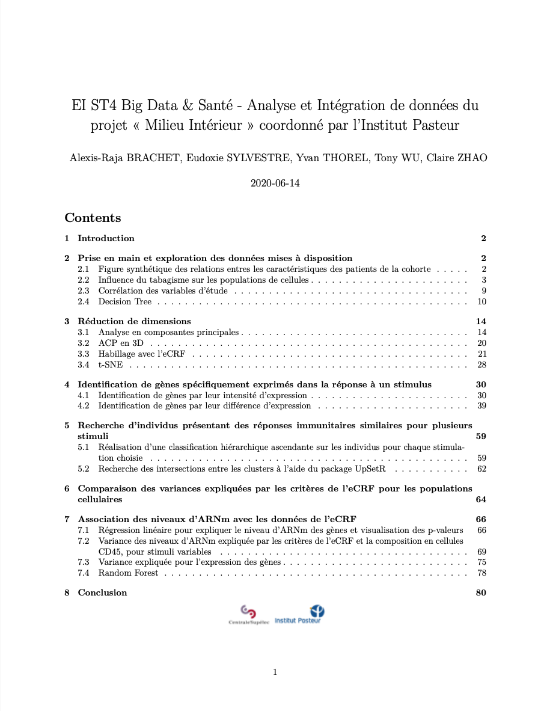
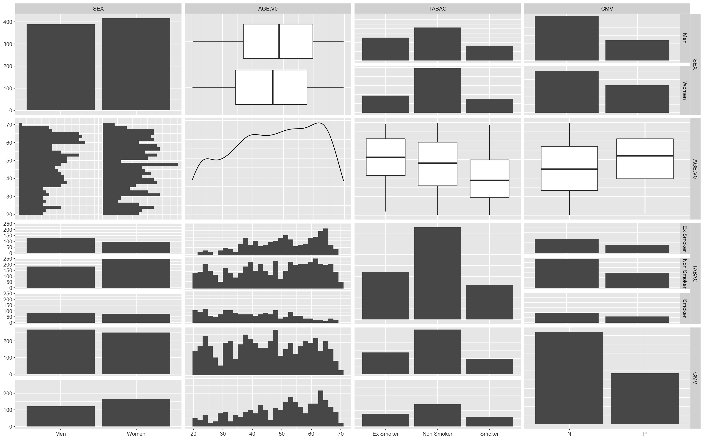
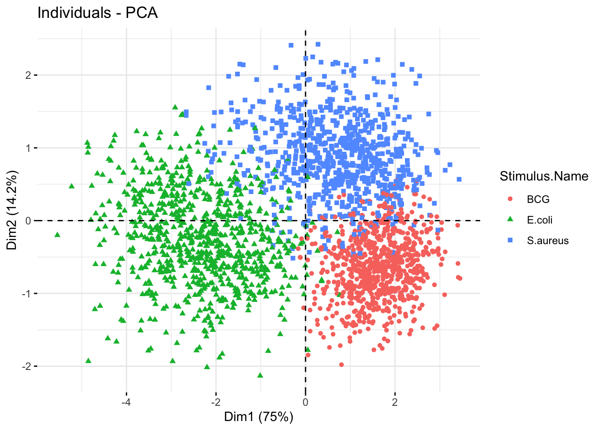
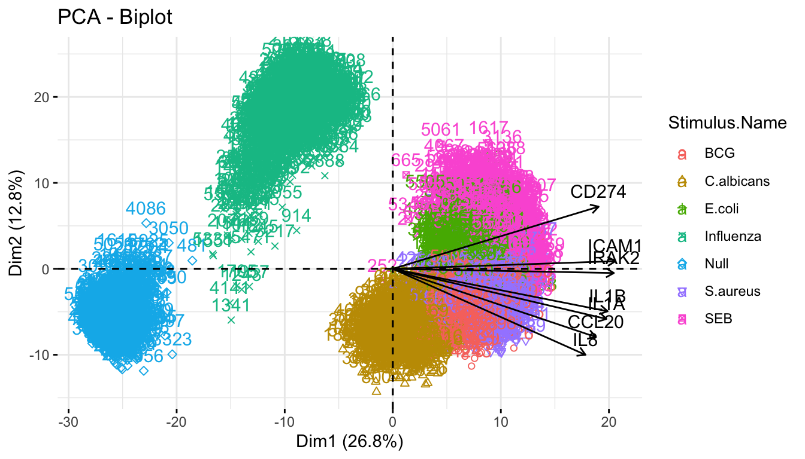
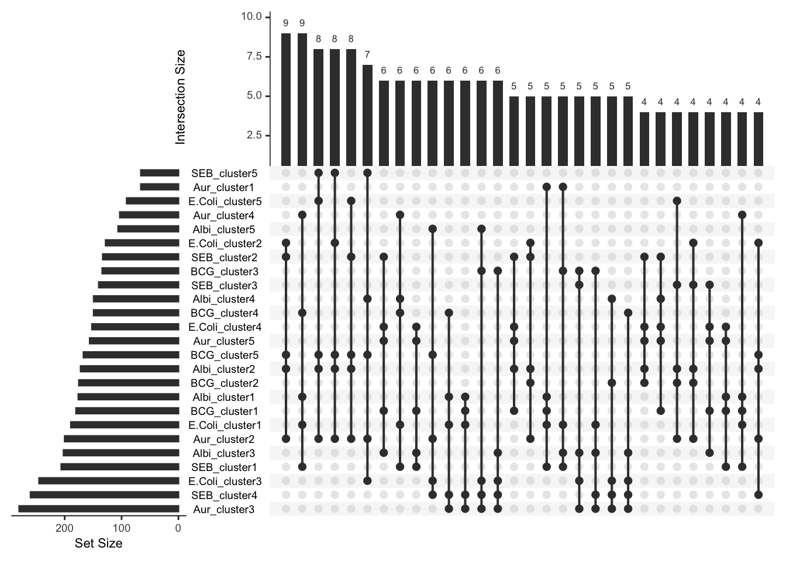
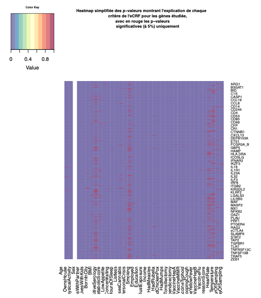
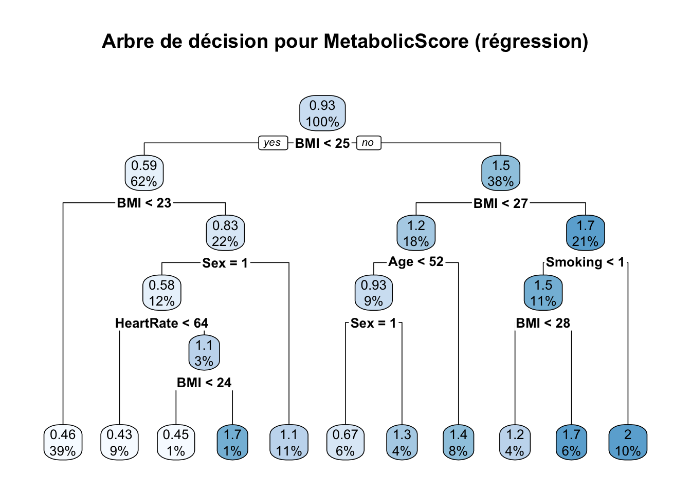
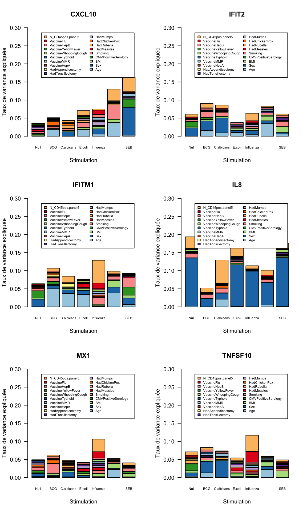

# Projet Milieu Intérieur

## Description du projet

Le projet « Milieu Intérieur », coordonné par l’Institut Pasteur, a été développé pour mieux comprendre la diversité des réactions immunes au sein de la population dans le but plus large de contribuer au développement de la médecine de précision. 

Dans le cadre de ce projet, une cohorte de 1000 individus a été constituée et plusieurs grands jeux de données ont été générés, notamment des données socio-démographiques et cliniques, des données de composition cellulaires sanguines, ainsi que des données d’expression géniques dans différentes conditions de stimulation immunes pour chacun des individus. 

Durant cette session, il nous a été proposé d’analyser et de croiser ces données entre elles afin d’identifier les facteurs qui différencient les individus dans leurs réponses aux stimulations immunes et éventuellement d’expliquer et de prédire ces réactions. L’objectif a été d’appliquer des méthodes d’analyse statistique descriptives et prédictives afin d’extraire de ces données des informations biologiques pertinentes.

## Contenu 

- Fichiers R ayant servi à générer le rapport
- Rapport de projet au format PDF

## Tâches réalisées

Voici quelques images issues du rapport illustrant grossièrement certains points intéressants de l'étude.

### Pairplot des données

### PCA sur les stimuli des maladies étudiées

### UpSet Plot pour visualiser l'intersection des clusters obtenus

### Heatmap des v-valeurs pour les données de l'eCRF

### Arbre de décision pour le *metabolic score*

### Variance expliquée par les données médicales à disposition

- 

## Remerciements

Violaine Saint-André et Vincent Guillemot de l'Institut Pasteur

Arthur Tenenhaus, professeur à CentraleSupélec

