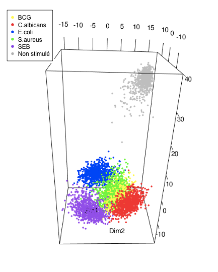
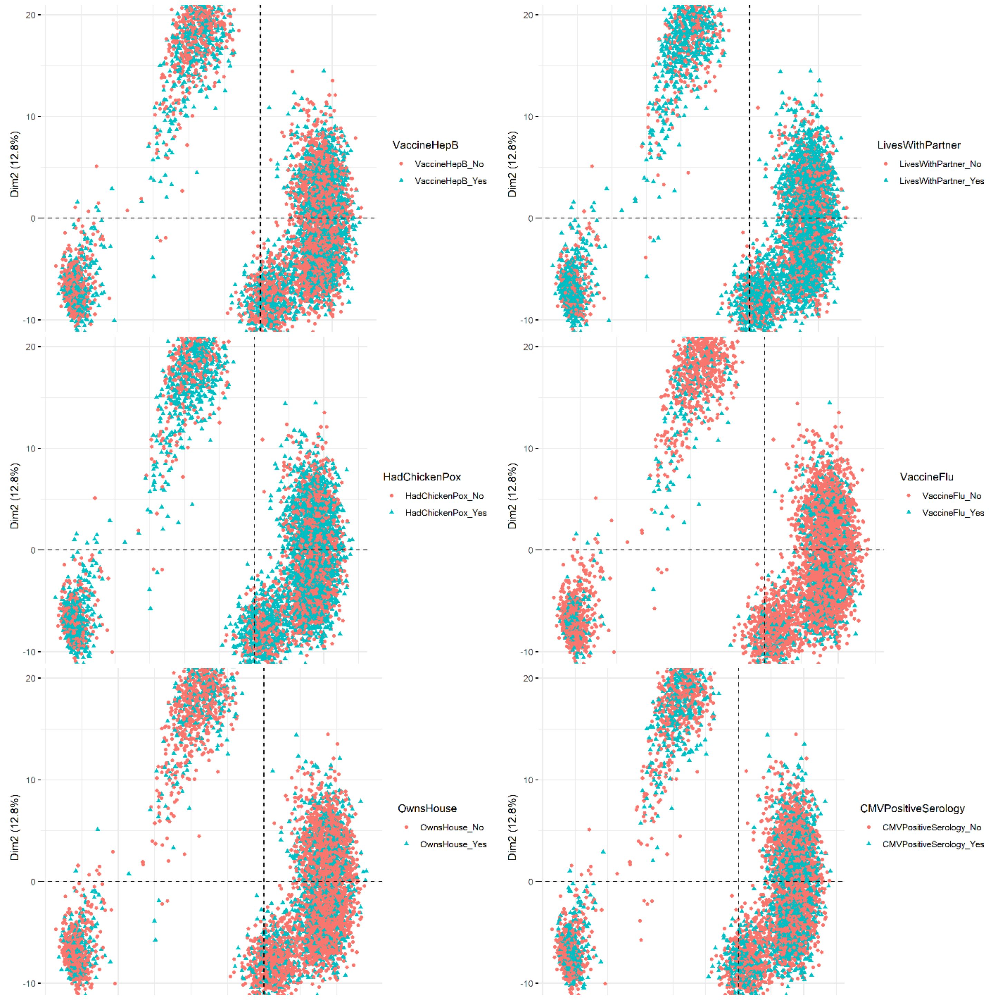
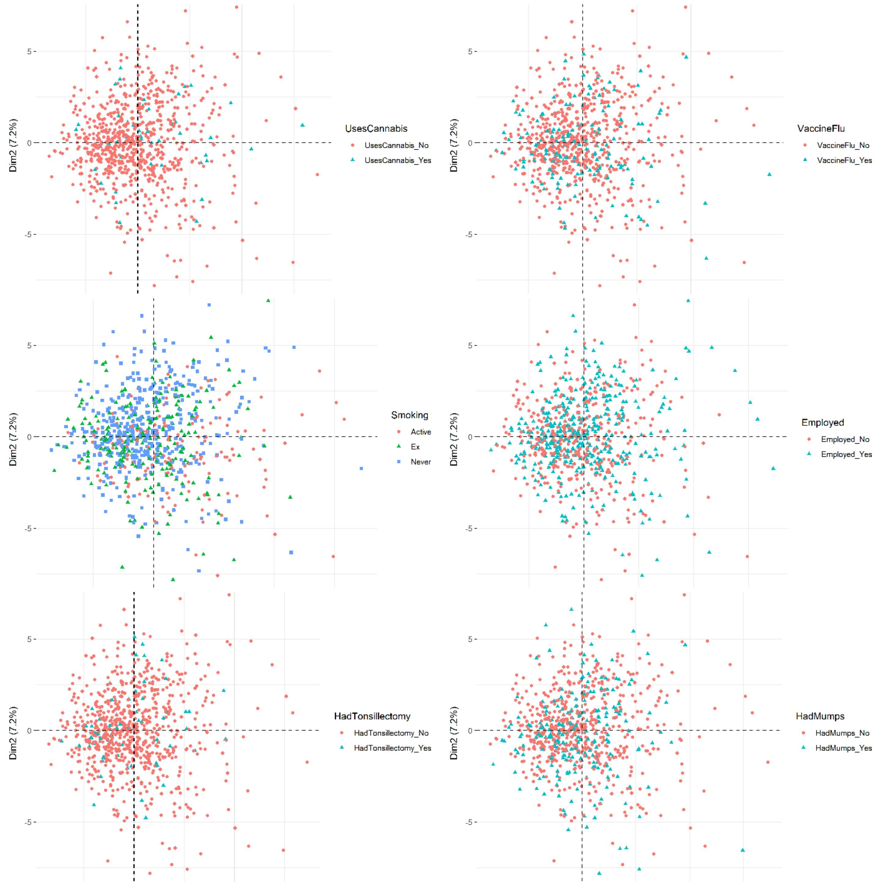

\begin{center}
\includegraphics{Images/logo_rapport_small.png}
\end{center}

# Introduction

Ce rapport a pour but de vous présenter le travail réalisé sur une semaine, en collaboration avec l’Institut Pasteur. Les données mises à notre disposition ont été récupérées à l'issu du projet "Milieu Intérieur". Ce projet, impliquant des centaines de sujets test, regroupe des données issues de questionnaires remplis par ces derniers, et des données d'expression des cellules et des 560 gènes impliqués dans la réponse immunitaire, en réponse à 5 stimuli, notamment le virus de la grippe (Influenza), le vaccin contre la tuberculose (BCG) et le staphilocoque doré (S.aureus).
Notre but au cours de cette semaine a été de mettre en pratique nos connaissances théoriques en statistique sur un sujet concret: la réponse immunitaire du corps humain. Ainsi, à l'aide de nos connaissances, nous avons analysé le grand nombre de données dont nous disposions afin d'identifier des facteurs influant la réponse immunitaire, des groupes de gènes caractérisant un stimuli donné... 


```{r Import des packages, include=FALSE}
library(dplyr)
library(superml)

library(gplots)
library(ggplot2)
library(GGally)
library(RColorBrewer)

library(rpart)
library(rpart.plot)


library(factoextra)
library(FactoMineR)

library(ade4)
library(rgl) 

library(Rtsne)

library(corrplot)
library(dendextend)

library(UpSetR)

library(randomForest)
```

```{r, include = FALSE}
knitr::opts_knit$set(cache=TRUE) 
```

```{r Import des données, include=FALSE}
expr <- read.table(file="./data/nanostring.txt", header=TRUE, sep='\t', stringsAsFactors = FALSE)
facs <- read.table(file="./data/facs_counts.txt", header=TRUE, sep='\t', stringsAsFactors = FALSE)
eCRF <- read.table(file="./data/eCRF.txt", header=TRUE, sep='\t', stringsAsFactors = FALSE)
patients <- read.table(file="./data/Sex_AgeCat_ID.txt", header=TRUE, sep='\t', stringsAsFactors = FALSE)
```


# Prise en main et exploration des données mises à disposition

## Figure synthétique des relations entres les caractéristiques des patients de la cohorte
```{r, cache=TRUE, message = FALSE, fig.height = 10, fig.width = 16}
ggpairs(patients[, -c(1,4)]) # on retire SUBJID et la colonne AGEVAT (car redondant avec AGE.V0)
```

En regardant les données sur la diagonale du graphique, on observe que la cohorte est telle que :
- il y a à peu près autant de femmes que d'hommes dans la cohorte
- les personnages âgées sont en plus grand nombre que les jeunes
- il y a plus environ 2 fois plus de personnes non-fumeurs que de personnes ayant déjà été ou qui sont actuellement fumeurs
- il y a plus environ 2 fois plus de personnes ayant déjà contracté le CMV que de personnes ne l'ayant jamais eu.


## Influence du tabagisme sur les populations de cellules
```{r}
l.cells <- names(facs)[-1] # on enlève la 1ère colonne qui est SUBJID
```

On initialise `df` puis onsépare `df` selon la consommation de tabac du patient et on en profite pour enlever les colonnes 'SUBJID' et 'TABAC' qui ne sont plus utiles pour la suite.
```{r}
df <- merge(x=patients[c('SUBJID', 'TABAC')], y=facs, by='SUBJID')
df <- df[complete.cases(df), ]

df_smoker <- df[df$TABAC == 'Smoker', -(1:2)]
df_non_smoker <- df[df$TABAC == 'Non Smoker',-(1:2)]
df_ex_smoker <- df[df$TABAC == 'Ex Smoker',-(1:2)]
```


On trace maintenant 3 boxplot les uns au-dessus des autres pour avoir une vision d'ensemble de l'influence du tabagisme sur les populations cellulaires d'étude.
```{r, fig.height=12, fig.width=8, warning=FALSE}
par(mfrow=c(3, 1))
boxplot(df_non_smoker, las=2, add=FALSE, col='green', main='Non-fumeurs')
boxplot(df_ex_smoker, las=2,  add=FALSE, col='orange', main='Ex-fumeurs')
boxplot(df_smoker, las=2, col='red', main='Fumeurs', main='Fumeurs')
```

Comme la figure est un peu grande, on va maintenant superposer les 3 graphiques.

```{r, fig.height=6, fig.width=8}
boxplot(df_non_smoker, las=2, add=FALSE, boxwex=1, col= rgb(0, 1, 0, alpha=0.5), 
        outline = FALSE, main='Comparaison des quantités de cellules en fonction 
        du tabagisme du patient')
boxplot(df_ex_smoker, las=2,  add=TRUE, boxwex=1.5, 
        col= rgb(1, 0.5, 0, alpha=0.5), outline = FALSE)
boxplot(df_smoker, las=2, add=TRUE, boxwex=2, 
        col=rgb(1, 0, 0, alpha=0.5), outline = FALSE)

legend("topright", title="Tabagisme", c("Non-fumeur","Ex-fumeur","Fumeur"), 
       fill=c(rgb(0, 1, 0, alpha=0.5), rgb(1, 0.5, 0, alpha=0.5), 
              rgb(1, 0, 0, alpha=0.5)) ,horiz=TRUE, cex=1)
```

Pour pouvoir étudier plus finement les données du graphique, du fait des grandes différences d'ordre de grandeur selon les populations de cellules, nous allons regrouper celles "nombreuses" et celles qui le sont moins pour essayer d'y voir plus clair.

On va donc créer des listes d'index regroupant ces 2 sous-ensembles de population.
```{r}
l.means <- colMeans(df_smoker)

l.huge <- c()
l.rest <- c()


idx = 0

for (mean.val in l.means){
  idx <- idx + 1
  if (mean.val > 1e+04){
    l.huge <- c(l.huge, idx)
  } else{
    l.rest <- c(l.rest, idx)
  }
}


df_non_smoker_huge <- df_non_smoker[, l.huge]
df_smoker_huge <- df_smoker[, l.huge]
df_ex_smoker_huge <- df_ex_smoker[, l.huge]


df_non_smoker_rest <- df_non_smoker[, l.rest]
df_smoker_rest <- df_smoker[, l.rest]
df_ex_smoker_rest <- df_ex_smoker[, l.rest]
```


**Première figure pour les cellules qui sont en moyenne à un nombre supérieur à 1e+4 :**
```{r, fig.height=4, fig.width=10}
boxplot(df_non_smoker_huge, las=2, add=FALSE, boxwex=1/3, 
        col= rgb(0, 1, 0, alpha=0.5), outline = FALSE, 
        main='Comparaison des quantités de cellules en fonction du tabagisme 
        du patient')
boxplot(df_ex_smoker_huge, las=2,  add=TRUE, boxwex=2/3, 
        col= rgb(1, 0.5, 0, alpha=0.5), outline = FALSE)
boxplot(df_smoker_huge, las=2, add=TRUE, boxwex=3/3, col=rgb(1, 0, 0, alpha=0.5), 
        outline = FALSE)

legend("topright", title="Tabagisme", c("Non-fumeur","Ex-fumeur","Fumeur"), 
       fill=c(rgb(0, 1, 0, alpha=0.5), rgb(1, 0.5, 0, alpha=0.5), 
              rgb(1, 0, 0, alpha=0.5)), horiz=TRUE, cex=1)
```

**Deuxième figure pour les cellules qui sont en moyenne à un nombre inférieur à 1e+4 :**
```{r, fig.height=15, fig.width=8}
nb_cells_rest <- dim(df_smoker_rest)[2]

col_per_plot <- 5
nb.iter <- ceiling(ncol(df_smoker_rest) / col_per_plot)
par(mfrow=c(ceiling(nb.iter/2), 2))

for (i in 0:(nb.iter-1)){
  # Distinction de cas selon qu'on est ou non à la dernière itération
  if (i < (nb.iter - 1) & i!=0){
    l.idx <- (i*col_per_plot + 1):((i+1)*col_per_plot)
  } else if(i == 0){
    l.idx <- 1:((i+1)*col_per_plot)
  } else{
    l.idx <- (i*col_per_plot):(ncol(df_smoker_rest))
  }
  
  #print(i)
  #print(l.idx)
  
  boxplot(df_non_smoker_rest[,l.idx], add=FALSE, boxwex=1/3, 
          col= rgb(0, 1, 0, alpha=0.5), outline = FALSE)
  boxplot(df_ex_smoker_rest[,l.idx],  add=TRUE, boxwex=2/3, 
          col= rgb(1, 0.5, 0, alpha=0.5), outline = FALSE)
  boxplot(df_smoker_rest[,l.idx], add=TRUE, boxwex=3/3, 
          col=rgb(1, 0, 0, alpha=0.5), outline = FALSE)
  
  legend("topright", title="Tabagisme", c("Non-fumeur","Ex-fumeur","Fumeur"), 
         fill=c(rgb(0, 1, 0, alpha=0.5), rgb(1, 0.5, 0, alpha=0.5), 
                rgb(1, 0, 0, alpha=0.5)), horiz=TRUE, cex=1)
}

mtext('Comparaison des quantités de cellules en fonction du tabagisme du patient', 
      outer = TRUE, cex = 1.5)
```


## Corrélation des variables d'étude

On cherche à manipuler les données du  questionnaire eCRF et à visualiser leur corrélation.

```{r}
eCRF <- mutate(eCRF, OwnsHouse = (OwnsHouse == 'Yes'))
eCRF <- mutate(eCRF, LivesWithPartner = (LivesWithPartner == 'Yes'))
eCRF <- mutate(eCRF, LivesWithKids = (LivesWithKids == 'Yes'))
eCRF <- mutate(eCRF, BornInCity = (BornInCity == 'Yes'))
eCRF <- mutate(eCRF, CMVPositiveSerology = (CMVPositiveSerology == 'Yes'))
eCRF <- mutate(eCRF, UsesCannabis = (UsesCannabis == 'Yes'))
eCRF <- mutate(eCRF, RecentPersonalCrisis = (RecentPersonalCrisis == 'Yes'))
eCRF <- mutate(eCRF, Employed = (Employed == 'Yes'))
eCRF <- mutate(eCRF, HadMeasles = (HadMeasles == 'Yes'))
eCRF <- mutate(eCRF, HadRubella = (HadRubella == 'Yes'))
eCRF <- mutate(eCRF, HadChickenPox = (HadChickenPox == 'Yes'))
eCRF <- mutate(eCRF, HadMumps = (HadMumps == 'Yes'))
eCRF <- mutate(eCRF, HadTonsillectomy = (HadTonsillectomy == 'Yes'))
eCRF <- mutate(eCRF, HadAppendicectomy = (HadAppendicectomy == 'Yes'))
eCRF <- mutate(eCRF, VaccineHepA = (VaccineHepA == 'Yes'))
eCRF <- mutate(eCRF, VaccineMMR = (VaccineMMR == 'Yes'))
eCRF <- mutate(eCRF, VaccineTyphoid = (VaccineTyphoid == 'Yes'))
eCRF <- mutate(eCRF, VaccineWhoopingCough = (VaccineWhoopingCough == 'Yes'))
eCRF <- mutate(eCRF, VaccineYellowFever = (VaccineYellowFever == 'Yes'))
eCRF <- mutate(eCRF, VaccineHepB = (VaccineHepB == 'Yes'))
eCRF <- mutate(eCRF, VaccineFlu = (VaccineFlu == 'Yes'))


eCRF <- eCRF[,-c(35)] #on enlève les var qui ne conviennent pas (SUBJID, sexe...)
eCRF <- eCRF[,-c(21)]
eCRF <- eCRF[,-c(20)]
eCRF <- eCRF[,-c(19)]
eCRF <- eCRF[,-c(17)]
eCRF <- eCRF[,-c(4)]

```


#Visualisation de la corrélation


```{r, warning = FALSE}


ggcorr(eCRF, method = c("everything", "pearson"))

```


On a ainsi un aperçu des corrélations entre les différentes caractéristiques, qui paraissent cohérentes. Certaines sont interéssantes : 
- La température et l'âge sont anti-corrélés : la température corporelle diminue avec l’âge pour des raisons physiologiques (diminution de l'action de l’hypothalamus, glande dont le rôle est de maintenir la température du corps humain à 37°, métabolisme moins actif)
- l'IMC et le score métabolique sont positivement corrélés
- un score de dépression élevé est lié à une indolence/paresse élevée ('listless') et à une difficulté à se concentrer.


On réimporte `eCRF` comme on a précédemment écrit sur le dataFrame.
```{r}
eCRF <- read.table(file="./data/eCRF.txt", header=TRUE, sep='\t', stringsAsFactors = FALSE)
```


## Decision Tree

Encodage des données qualitatives
```{r}
drop <- c("SUBJID") # drop contient la liste des colonnes à supprimer
df_1 <- eCRF[,!(names(eCRF) %in% drop)]
```

On stocke maintenant les index des colonnes contenant des variables qualitatives dans l'optique de les transformer avec une sorte de *One-Hot Encoding*.
```{r}
l.idx_chr <- sapply(df_1, is.character)
```

Sorte de LabelEncoder de Scikit mais pour R. Pour des raisons de simplicité, pour savoir à quoi correspond chaque label, lancer `View(eCRF)` (données brutes) et `View(df_1)`(après encodage) et comparer.

**NE SURTOUT PAS ESSAYER DE DEVINER LES SENS DES ENCODAGES SANS CETTE ETAPE PRELIMINAIRE !!**
```{r}
for (i in 1:length(l.idx_chr)){
  if (l.idx_chr[i]==TRUE){ # Si la colonnes présente des variables qualitatives...
    # print(i)
    df_1[, i] <- LabelEncoder$new()$fit_transform(df_1[, i]) # Encodage
  }
}
```


**Construction de l'arbre de décision**
On essaie de prédire MetabolicScore en fonction des autres données en indiquant à `rpart` la formule `MetabolicScore ~ .`.
```{r}
fit.tree <- rpart(
  MetabolicScore ~ ., 
  data = df_1)
```


```{r, message=FALSE, warning=FALSE}
rpart.plot(fit.tree, main="Arbre de décision pour MetabolicScore (régression)")
```
 
**Interpréation :**
On remarque que le premier critère influençant sur le *MetabolicScore* est le *BMI*.

Voici un extrait de https://www.nhlbi.nih.gov/health/educational/lose_wt/BMI/bmicalc.htm :
BMI Categories: 
- Underweight = <18.5
- Normal weight = 18.5–24.9 
- Overweight = 25–29.9 
- Obesity = BMI of 30 or greater

Ceci n'est pas si surprenant car il est maintenant connu que le surpoids est une des principales causes de problèmes cardio-vasculaires. Ou plus directement, il est possible de se référer à *The Milieu Intérieur study — An integrative approach for study of human
immunological variance* de Thomas et al. aux pages 288 et 289 pour voir que le BMI est étroitement lié au MetabolicScore.

On remarque ensuite que les 2 autres principaux facteurs sont l'*âge* et le *sexe*, caractéristiques qui ont déjà été explicitée dans les thèses fournies !


On fait de même pour d'autres features intéressantes.

**Pour HoursOfSleep :**
```{r}
fit.tree <- rpart(
  HoursOfSleep ~ ., 
  data = df_1)

rpart.plot(fit.tree, main="Arbre de décision pour HoursOfSleep (régression)")
```

**Pour DepressionScore :**
```{r}
fit.tree <- rpart(
  DepressionScore ~ ., 
  data = df_1)

rpart.plot(fit.tree, main="Arbre de décision pour DepressionScore (régression)")
```

**Pour CMVPositiveSerology :**
```{r}
fit.tree <- rpart(
  CMVPositiveSerology ~ ., 
  data = df_1)

rpart.plot(fit.tree, main="Arbre de décision pour CMVPositiveSerology (classification)")
```
 
**Interpréation :**
Avant tout, on rappelle que le cytomégalovirus (ou CMV) est un virus responsable d'infections et donc dangereux.
On remarque sur la figure ci-dessus, l'age est le premier facteur contribuant à l'apparition du CMV. Néamoins, pour les moins de 50 ans, on peut critiquer la séparation obtenue car un BMI supérieur à 29 est synonyme d'obésité et il semble peu probable qu'être obèse rende moins susceptible de contracter le virus...


# Réduction de dimensions
## Analyse en composantes principales

```{r, fig.height=3, fig.height=4}
respca = PCA(X=expr, scale.unit=TRUE, graph=F, ncp=5, quali.sup=1:2)

fviz_pca_ind(respca, 
              axes = c(1,2), 
              habillage = 'Stimulus.Name', 
              invisible = 'quali',
              label ="none")
```


```{r, fig.height=3, fig.height=4}
fviz_pca_ind(respca, 
              axes = c(1,3), 
              habillage = 'Stimulus.Name', 
              invisible = 'quali',
              label ="none")
```
```{r, cache=TRUE, fig.height=3, fig.height=4}
fviz_pca_ind(respca, 
              axes = c(1,4), 
              habillage = 'Stimulus.Name', 
              invisible = 'quali',
              label ="none")

```
L'analyse en composantes principales nous indique que c'est la stimulation à inflenza qui engendre la réponse immunitaire la plus distincte. On voit aussi que l'absence de stimulation se distingue nettement sur l'axe 1. Tous ces résultats sont en accord avec l'ACP de Piasecka.


### Pourcentage de variance capturée par chaque composante

```{r, fig.height=3, fig.height=4}

fviz_screeplot(respca, addlabels=TRUE,hjust=-0.3)

```
La 3ème composante capture près de 10% de la variance, il est donc mieux de s'intéresser aux trois premières composantes. 

### Cercle des corrélations
On sélectionne les covariables les plus corrélées avec les deux premiers axes, c'est-à-dire de cosinus carré supérieur à 0.9.
```{r, fig.height=3, fig.height=5}
  
fviz_pca_var(respca, axes = c(1,2),  select.var = list(cos2 = 0.9), col.var="cos2", repel=TRUE, gradient.cols = c("orange", "blue"))

```

### Biplot

```{r, fig.height=3, fig.height=4}

fviz_pca_biplot(respca, axes = c(1, 2), habillage = "Stimulus.Name", 
                select.var = list(cos2 = 0.9), col.var = "black", 
                invisible = c("quali"), repel = FALSE)

```
Le niveau d'ARNm du gène TNFSF10 semble fortement associé à la stimulation à l'influenza.

```{r, fig.height=3, fig.height=4}

fviz_pca_biplot(respca, axes = c(1, 2), habillage = "Stimulus.Name", 
                select.var = list(cos2 = 0.93), col.var = "black", invisible = c("quali"))

```
Le niveau d'ARNm des gènes IL1A et IL1B semble fortement associé à la stimulation à S.aureus, et le niveau d'ARNm du gène CD274 semble fortement associé à la stimulation à SEB et E.coli.


## ACP en 3D
```{r, results="hide", eval=FALSE}
# Code pour faire l'ACP
acp = dudi.pca(expr[,-c(1,2)], scannf= F,scale=FALSE,nf=3)
```

On trace le graphique 3D, avec les mêmes couleurs que celles utilisées dans l'article Piasecka.
Pour accélérer la création du rapport, nous avons déjà enregistré le résultat obtenu que nous avons affiché ci-dessous.

```{r, eval=FALSE}

#stimulus BCG
plot3d(acp$li[,1][expr$Stimulus.Name=="BCG"],
       acp$li[,2][expr$Stimulus.Name=="BCG"],
       acp$li[,3][expr$Stimulus.Name=="BCG"],
       col="yellow",
       radius=0.4,
       type="p",
       xlab="Dim1",ylab="Dim2",zlab="Dim3",
       )


#pas de stimulus IAV dans les données expr

#Ajout stimulus C.albicans
spheres3d(acp$li[,1][expr$Stimulus.Name=="C.albicans"],
         acp$li[,2][expr$Stimulus.Name=="C.albicans"],
         acp$li[,3][expr$Stimulus.Name=="C.albicans"],
         col="red",
         radius=0.4)

#Ajout stimulus E.coli
spheres3d(acp$li[,1][expr$Stimulus.Name=="E.coli"],
         acp$li[,2][expr$Stimulus.Name=="E.coli"],
         acp$li[,3][expr$Stimulus.Name=="E.coli"],
         col="blue",
         radius=0.4)

#Ajout stimulus S.aureus
spheres3d(acp$li[,1][expr$Stimulus.Name=="S.aureus"],
         acp$li[,2][expr$Stimulus.Name=="S.aureus"],
         acp$li[,3][expr$Stimulus.Name=="S.aureus"],
         col="green",
         radius=0.4)

#Ajout stimulus SEB
spheres3d(acp$li[,1][expr$Stimulus.Name=="SEB"],
         acp$li[,2][expr$Stimulus.Name=="SEB"],
         acp$li[,3][expr$Stimulus.Name=="SEB"],
         col="purple",
         radius=0.4)


#Ajout stimulus NS
spheres3d(acp$li[,1][expr$Stimulus.Name=="Null"],
         acp$li[,2][expr$Stimulus.Name=="Null"],
         acp$li[,3][expr$Stimulus.Name=="Null"],
         col="grey",
         radius=0.4)


#Ajout légende

legend3d("topleft", 
         legend = c("BCG", "C.albicans", "E.coli", "S.aureus", "SEB", "Non stimulé"), 
         pch = 16, 
         col = c("yellow", "red", "blue", "green", "purple", "grey"), 
         cex=1,
         inset=c(0.02))

```

On voit bien 3 groupes distincts selon les stimulations d'origine virale (Influenza) et les 5 autres.





## Habillage avec l'eCRF
### Nanostring
Il peut être intéresser, après avoir réalisé une réduction de dimension, d'habiller les données avec les données de l'eCRF afin de voir lesquelles engendrent une forte différence que ce soit dans l'expression des gènes stimulés, ou dans la composition cellulaire.


```{r}
df <- merge(x=eCRF, y=expr, by.x ='SUBJID', by.y ='SUBJID')
```

On réalise une ACP sur les données de nanostring.
```{r}
res.pca <- PCA(df, scale.unit=TRUE, graph=F, ncp=5, quali.sup=1:(ncol(eCRF)+1))
```

On colorie cet ACP selon chacun des critères de l'eCRF, et on affiche quelques résultats.
```{r, eval=FALSE, warning=FALSE}
lcol = names(df)[2:40]
for(col in lcol){
  fviz_pca_ind(res.pca, 
              axes = c(1,2), 
              habillage=col,
              invisible = 'quali',
              label ="none")
  ggsave(paste(col, ".png",sep=''))

}
```

On remarque que pour la grande majorité des critères de l'eCRF, aucune différence n'est visible dans l'ACP. Cela nous indique que la plupart des critères, pris séparément, n'influe que peu sur la composition cellulaire.

On affiche le résultat pour le sexe, qui est un des seuls critères où la différence est marquée.

```{r}
fviz_pca_ind(res.pca, 
              axes = c(1,2), 
              habillage='Sex',
              invisible = 'quali',
              label ="none")
```
 
Il est intéressant de voir que l'expression des gènes varie de facon assez importante selon le sexe. On peut voir quels sont les gènes les plus fortement associés au sexe, ce sont les gènes orientés selon la diagonale descendante dans le cercle des corrélations : 

```{r}
  
fviz_pca_var(res.pca, axes = c(1,2),  select.var = list(cos2 = 0.92), 
             col.var="cos2", gradient.cols = c("orange", "blue"))

```
 
L'expression du gène IL8 par exemple semble plus associée au sexe féminin.

### Facs

```{r}
df <- merge(x=eCRF, y=facs, by='SUBJID')
```


```{r, warning = FALSE}
res.pca <- PCA(df,scale.unit=TRUE, graph=F, ncp=5, quali.sup=1:40)
```

Dans le chunk suivant, nous avons coloré l'ACP précédente en fonction des différents critères de l'eCRF.
```{r, eval=FALSE, warning=FALSE}
lcol = names(df)[2:40]
for(col in lcol){
  fviz_pca_ind(res.pca, 
              axes = c(1,2), 
              habillage=col,
              invisible = 'quali',
              label =none")
  ggsave(paste("PCA facs/", col, ".png",sep=''))
}

```



On remarque comme pour nanostring que peu de critères sont différenciés.
La positivité au CMV l'est :

```{r, fig.height=3, fig.height=4}
fviz_pca_ind(res.pca, 
              axes = c(1,2), 
              habillage='CMVPositiveSerology',
              invisible = 'quali',
              label ="none")
```
On visualise les cellules de la réponse immunitaire au CMV, pour vérifier qu'elles sont bien selon l'axe 2 qui différencie la positivité au CMV, vers le bas.
```{r, fig.height=3, fig.height=4}

fviz_pca_biplot(res.pca, axes = c(1, 2), habillage = "CMVPositiveSerology", 
                select.var = list(name = c("N_CD4pos_EMRA.panel1", 
                                           "N_HLADRpos_in_CD4pos_EMRA.panel1",
                                           "N_CD8bpos_EMRA.panel1",
                                           "N_HLADRpos_in_CD8bpos_EMRA.panel1")), 
                col.var = "black", invisible = c("quali"), label = c("var"))
```


## t-SNE
Le t-SNE est une autre technique de réduction de dimension, mais non linéaire. Le principe est que l'on chercher à garder la même distance entre les points dans l'espace de départ et dans l'espace de petite dimension.
Le résultat conserve donc mieux les distances que le résultat de l'ACP.
```{r}
label = expr$Stimulus.Name
data = subset(expr, select = - c(SUBJID,Stimulus.Name)) # on récupère les données dans expr
tsne <- Rtsne(data, dims = 2, perplexity=30, verbose=TRUE, max_iter = 500)
```

```{r}
colors = rainbow(7)
names(colors) = unique(label)
plot(tsne$Y, main="t-SNE, perplexité = 30", col = colors)
legend("bottomright", unique(label), col = colors, pch=1, cex=0.6)
```

```{r}
tsne <- Rtsne(data, dims = 2, perplexity=100, verbose=TRUE, max_iter = 500)

```

```{r}
colors = rainbow(7)
names(colors) = unique(label)
plot(tsne$Y, main="t-SNE, perplexité = 100", col = colors)
legend("bottomright", unique(label), col = colors, pch=1, cex=0.6)
```

On remarque que le t-SNE permet de séparer les différentes stimulations, bien mieux que l'ACP.
On remarque aussi que lorsque la perplexité augmente, l'algorithme tend à rapprocher les stimulations BCG et S.aureus, ce qui pourrait indiquer une simularité dans l'expression des gênes pour ces deux stimulations.


# Identification de gènes spécifiquement exprimés dans la réponse à un stimulus
```{r Extaction des données, include=FALSE}
## Extraire les niveaux d'ARNm pour la stimulation E. coli 

expColi <- expr[expr$Stimulus.Name=='E.coli',]
expColigenes <- expColi[,-c(1:2)]

##Extraction stimulation BCG
expBCG <- expr[expr$Stimulus.Name=='BCG',]
expBCGgenes <- expBCG[,-c(1:2)]

##Extraction stimualtion Null
expN <- expr[expr$Stimulus.Name=='Null',]
expNgenes <- expN[,-c(1:2)]

##Extraction stimulation Influenza
expI <- expr[expr$Stimulus.Name=='Influenza',]
expIgenes <- expI[,-c(1:2)]

##Extraction stimulation SEB
expSEB <- expr[expr$Stimulus.Name=='SEB',]
expSEBgenes <- expSEB[,-c(1:2)]

##Extraction stimulation SAU
expSau <- expr[expr$Stimulus.Name=='S.aureus',]
expSaugenes <- expSau[,-c(1:2)]

##Extraction des données C.albicans
expCal <- expr[expr$Stimulus.Name=='C.albicans',]
expCalgenes <- expCal[,-c(1:2)]

```

## Identification de gènes par leur intensité d'expression 
 
Notre but ici est d’identifier l’expression de gènes caractéristiques dans la réponse à un stimulus à l’aide du clustering hierarchique. Dans un premier temps, nous allons identifier ces gènes à l’aide de la visualisation sur une heatmap. Puis nous allons vérifier que des gènes exprimés ne se retrouvent pas dans la réponse à aucun stimulus. Enfin, nous allons effectuer une ACP uniquement sur les gènes spécifiquement identifiés et conclure si ces gènes permettent de séparer le groupe stimulé au virus d’intérêt. Nous allons détailler cette méthode pour le virus de la grippe : Influenza.  
 
### Descritpion détaillée de la méthode pour le virus de la grippe Influenza 
 
 
**Extraction des données**  
```{r Extraction des données} 
#Extraction stimulation Influenza 
expI <- expr[expr$Stimulus.Name=='Influenza',] 
expIgenes <- expI[,-c(1:2)] #Suppression des données qualitatives 
 
``` 

**Création d’une heatmap** 
```{r Préparation des paramètres pour effectuer une heatmap} 
myPalette <- colorRampPalette(rev(brewer.pal(11, "Spectral"))) 
  
## Fonction pour réaliser le dendogramme  
hclusfun <- function(x) hclust(dist(x), method="ward.D")  
## Conversion du data.frame en matrix 
expIgenes <- as.matrix(expIgenes)
```

```{r, include=FALSE} 
expColigenes <- as.matrix(expColigenes)
expBCGgenes <- as.matrix(expBCGgenes)
expNgenes <- as.matrix(expNgenes)
expSEBgenes <- as.matrix(expSEBgenes)
expSaugenes <- as.matrix(expSaugenes)
expCalgenes <- as.matrix(expCalgenes)
```

**Affichage de la heatmap**  
```{r heatmap stimulus Flu} 
##Heatmap Influenza 
heatmapFlu <- heatmap.2(expIgenes, dendrogram="both", scale="none", 
trace="none", key=TRUE, col=myPalette, hclustfun = hclusfun,  
cexRow = 0.1, cexCol=0.1) 
``` 


Nous pouvons remarquer un groupe de gènes dont la coloration est bien plus foncée que les autres. Allons extraire ce groupe de gènes particulier. Dans un premier temps, nous avons extrait les gènes les plus foncés. Ils sont au nombre de 2-3, qui sont B2M (Beta-2-Microglobulin) et IL32 (Interleukin 32), pour chaque stimulus et il se trouve que ces gènes sont aussi très exprimés dans les échantillons sans stimulus. Ces deux gènes jouent des rôles essentiels dans la réponse immunitaire (d'après le site **genecards.org**), donc leur forte expression pour chacune des situations étudiées est justifiée. 
\par Ainsi, ces gènes ne sont pas très intéressants pour caractériser la réponse immunitaire à la grippe. Ainsi, dans un second temps, nous avons extrait le deuxième groupe de gènes le plus exprimé ne comprenant pas ces 2-3 gènes cités précédemment. 
\par Pour ce faire, nous avons extrait le dendrogramme des gènes de la heatmap. Ensuite, nous avons dessiné les clusters à l’aide de la fonction rect.dendrogram(), en testant plusieurs valeurs de k jusque notre cluster d'intérêt soit isolé et nous avons coloré ces groupes pour identifier le numéro du cluster d’intérêt, comprenant les gènes qui sont le plus exprimés, à part les deux gènes cités précédemment.     
 
```{r} 
dendroFlu <- heatmapFlu$colDendrogram 
dendroFlu <- as.dendrogram(dendroFlu)
clustersFlu <- cutree(dendroFlu, k=16) 
groupCodes <- clustersFlu 
colorCodes <- c("white", "white", "white", "white", "white", "white", "white", "white", "white", "white", "white", "white", "white", "white", "white", "blue") 
  
labels_colors(dendroFlu) <- colorCodes[groupCodes][order.dendrogram(dendroFlu)] 
plot(dendroFlu) 
rect.dendrogram(dendroFlu, k=16) 
 
``` 
```{r Récupération du cluster intéressant à partir des heatmaps Flu} 
exprMaxHeatmapFlu <- names(clustersFlu)[clustersFlu==16] 
exprMaxHeatmapFlu 
 
``` 
Ces gènes identifiés, nous les avons ensuite utilisés pour réaliser l’ACP, en ne les sélectionnant que eux, et voir si l'expression de ces gènes peut carctériser la réponse au virus de la grippe.   


```{r heatmap avec différents stimuli, include=FALSE}
## chaisisser une palette, par exemple "spectral" et créez un gradient de couleurs
myPalette <- colorRampPalette(rev(brewer.pal(11, "Spectral")))

## dendogramme 
hclusfun <- function(x) hclust(dist(x), method="ward.D")
#hclusfunBCG <- function(x) hclustBCG(dist(x), method="ward.D")

expColigenes <- as.matrix(expColigenes)
expBCGgenes <- as.matrix(expBCGgenes)
expNgenes <- as.matrix(expNgenes)
expIgenes <- as.matrix(expIgenes)
expSEBgenes <- as.matrix(expSEBgenes)
expSaugenes <- as.matrix(expSaugenes)
expCalgenes <- as.matrix(expCalgenes)

## Heatmap E.Coli
heatmapColi <- heatmap.2(expColigenes, dendrogram="both", scale="none",
trace="none", key=TRUE, col=myPalette, hclustfun = hclusfun, 
cexRow = 0.1, cexCol=0.1)

dendoColi <- heatmapColi$colDendrogram
clustersColi <- cutree(dendoColi, k=12)
exprMaxHeatmapColi <- names(clustersColi)[clustersColi==11]
exprMaxHeatmapColi
table(clustersColi)

groupCodes <- clustersColi
colorCodes <- c("white", "white", "white", "white", "white", "white", "white", "blue", "white", "white", "white", "white", "white")

labels_colors(dendoColi) <- colorCodes[groupCodes][order.dendrogram(dendoColi)]
plot(dendoColi)
rect.dendrogram(dendoColi, k=12)

## Heatmap BCG
heatmapBCG <- heatmap.2(expBCGgenes, dendrogram="both", scale="none",
trace="none", key=TRUE, col=myPalette, hclustfun = hclusfun, 
cexRow = 0.1, cexCol=0.1)
plot(heatmapBCG$colDendrogram)

dendoBCG <- heatmapBCG$colDendrogram
clustersBCG <- cutree(dendoBCG, k=12)
exprMaxHeatmapBCG <- names(clustersBCG)[clustersBCG==11]
exprMaxHeatmapBCG
table(clustersBCG)

groupCodes <- clustersBCG
colorCodes <- c("white", "white", "white", "white", "white", "white", "pink", "blue", "white", "green", "yellow", "black")

labels_colors(dendoBCG) <- colorCodes[groupCodes][order.dendrogram(dendoBCG)]
plot(dendoBCG)
rect.dendrogram(dendoBCG, k=12)


## Heatmap Null
heatmapNull <- heatmap.2(expNgenes, dendrogram="both", scale="none",trace="none", key=TRUE, col=myPalette,hclustfun = hclusfun, cexRow = 0.1, cexCol=0.1)


## Heatmap en centrant et normant les données
#heatmap.2(expColigenes, dendrogram="both", scale="row", trace="none", col=myPalette, hclustfun = hclusfunC, cexRow = 0.1, cexCol=0.1)


dendoN <- heatmapNull$colDendrogram
clustersN <- cutree(dendoN, k=15)
exprMaxHeatmapN <- names(clustersN)[clustersN==11]
exprMaxHeatmapN
table(clustersN)
intersect(exprMaxHeatmapFlu,exprMaxHeatmapN)

groupCodes <- clustersN
colorCodes <- c("white","white","white","white","white","white","white","white","white","white","blue","white", "white", "white", "white")

labels_colors(dendoN) <- colorCodes[groupCodes][order.dendrogram(dendoN)]
plot(dendoN)
rect.dendrogram(dendoN, k=15)

## Heatmap SEB
heatmapSEB <- heatmap.2(expSEBgenes, dendrogram="both", scale="none",trace="none", key=TRUE, col=myPalette,hclustfun = hclusfun, cexRow = 0.1, cexCol=0.1)

plot(heatmapSEB$colDendrogram)


dendoSEB <- heatmapSEB$colDendrogram
clustersSEB <- cutree(dendoSEB, k=9)
exprMaxHeatmapSEB <- names(clustersSEB)[clustersSEB==9]
table(clustersSEB)

groupCodes <- clustersSEB
colorCodes <- c("white","white","white","white","white","yellow","white","white","pink")
labels_colors(dendoSEB) <- colorCodes[groupCodes][order.dendrogram(dendoSEB)]
plot(dendoSEB)
rect.dendrogram(dendoSEB, k=9)


## Heatmap S.aureus
heatmapSau <- heatmap.2(expSaugenes, dendrogram="both", scale="none",trace="none", key=TRUE, col=myPalette,hclustfun = hclusfun, cexRow = 0.1, cexCol=0.1)

plot(heatmapSau$colDendrogram)

dendoSau <- heatmapSau$colDendrogram
clustersSau <- cutree(dendoSau, k=13)
exprMaxHeatmapSau <- names(clustersSau)[clustersSau==13]
exprMaxHeatmapSau
table(clustersSau)

groupCodes <- clustersSau
colorCodes <- c("white","white","white","white","white","yellow","white","white","pink","pink","blue","white", "green")
labels_colors(dendoSau) <- colorCodes[groupCodes][order.dendrogram(dendoSau)]
plot(dendoSau)
rect.dendrogram(dendoSau, k=13)

##Heatmap Influenza
heatmapCal <- heatmap.2(expCalgenes, dendrogram="both", scale="none",
trace="none", key=TRUE, col=myPalette, hclustfun = hclusfun, 
cexRow = 0.1, cexCol=0.1)
plot(heatmapCal$colDendrogram)

dendroCal <- heatmapCal$colDendrogram
dendroCal <- as.dendrogram(dendroCal)
clustersCal <- cutree(dendroCal, k=14)
exprMaxHeatmapCal1 <- names(clustersCal)[clustersCal==12]
exprMaxHeatmapCal2 <- names(clustersCal)[clustersCal==13]

names(clustersCal)[clustersCal==7]
exprMaxHeatmapCal1
exprMaxHeatmapCal2
table(clustersCal)

#colors() #selectionner les couleurs qui nous intéressent
groupCodes <- clustersCal
colorCodes <- c("white","white","white","white","white","white","white","white","white","yellow","white","blue", "blue", "white")

labels_colors(dendroCal) <- colorCodes[groupCodes][order.dendrogram(dendroCal)]
plot(dendroCal)

#plot(dendoFlu)
rect.dendrogram(dendroCal, k=14)
```


```{r} 
fit.pca <- PCA(X=expr[,c("SUBJID","Stimulus.Name",exprMaxHeatmapFlu)], scale.unit = TRUE,quali.sup = 1:2) 
```
  
```{r} 
fviz_pca_ind(fit.pca,  
              axes = c(1,2),  
              habillage = 'Stimulus.Name',  
              invisible = 'quali', 
              label ="none")  
  
``` 

Nous pouvons voir que les gènes identifiés à l'aide du clustering hiérarchique discriminent bien les stimulations au virus de la grippe. Le groupe soumis à Influenza se distingue des autres selon le premier axe principal. Ces gènes sont donc caractéristiques de la réponse immunitaire à ce virus. De plus, l'ACP est très efficace ici car l'axe 1 couvre 56.7% de variance, ce qui est très correct. Ce résultat est ainsi très intéressant, et nous pouvons étudier plus en détail ces gènes à l’aide de méthodes différentes, ce que nous ferons par la suite.  
 
### Travail similaire sur les cinq autres stimuli
Nous allons effectuer le même type d'étude et voir si nous pouvons indetifier des gènes caratéristiques dans la réponse immunitaires contre les stimuli étudiés.

**E.coli**
```{r, include=FALSE}
fit.pca <- PCA(X=expr[,c("SUBJID","Stimulus.Name",exprMaxHeatmapColi)], 
               scale.unit = TRUE,quali.sup = 1:2)
```

```{r}
fviz_pca_ind(fit.pca, 
              axes = c(1,2), 
              habillage = 'Stimulus.Name', 
              invisible = 'quali',
              label ="none") 

```

**BCG**
```{r,include=FALSE}
fit.pca <- PCA(X=expr[,c("SUBJID","Stimulus.Name",exprMaxHeatmapBCG)], scale.unit = TRUE,quali.sup = 1:2)
```

```{r}
fviz_pca_ind(fit.pca, 
              axes = c(1,2), 
              habillage = 'Stimulus.Name', 
              invisible = 'quali',
              label ="none") 

```


**SEB**
```{r, include=FALSE}
fit.pca <- PCA(X=expr[,c("SUBJID","Stimulus.Name",exprMaxHeatmapSEB)], scale.unit = TRUE,quali.sup = 1:2)
```

```{r}
fviz_pca_ind(fit.pca, 
              axes = c(1,2), 
              habillage = 'Stimulus.Name', 
              invisible = 'quali',
              label ="none") 

```

**S.aureus**
```{r, include=FALSE}
fit.pca <- PCA(X=expr[,c("SUBJID","Stimulus.Name",exprMaxHeatmapSau)], scale.unit = TRUE,quali.sup = 1:2)
```

```{r}
fviz_pca_ind(fit.pca, 
              axes = c(1,2), 
              habillage = 'Stimulus.Name', 
              invisible = 'quali',
              label ="none") 

```

**C.albicans**
```{r, include=FALSE}
fit.pca <- PCA(X=expr[,c("SUBJID","Stimulus.Name",exprMaxHeatmapCal2)], scale.unit = TRUE,quali.sup = 1:2)
```

```{r}
fviz_pca_ind(fit.pca, 
              axes = c(1,2), 
              habillage = 'Stimulus.Name', 
              invisible = 'quali',
              label ="none") 

```

### Analyses

\par Même si la méthode employée n'a pas été concluante pour les stimuli E.coli, BCG, S.aureus et SEB car ces stimuli restent fortement regroupés peu importe les gènes utilisés, la méthode a été efficace pour les stimuli Influenza et C.albicans car ces groupes se détachent souvent des autres, peu importe les gènes que l'on utilise pour réaliser l'ACP. 
\par N'ayant pas réussi à séparer les stimuli E.coli, BCG et S.aureus (SEB étant une stimulation à part, nous n'allons pas la considérer dans notre étude), nous essayer d'effectuer une analyse plus précise de ces stimuli afin d'essayer de les séparer. 
\par Nous avons essayé d'identifier des gènes caratéristiques de la réponse aux stimuli étudiés en s'intéressant à leur intensité d'expression. Il est naturel d'étudier désormais la différence d'expression des gènes par rapport aux stimuli. Nous allons l'étudier en effectuant un test d'anova à un facteur, qui est le stimulus, qui permettra de dire si oui ou non, les réactions aux stimuli sont bien différentes. Puis, nous visualiserons les profils d'expression des gènes sélectionnés précédemment à l'aide d'un boxplot afin de choisir les gènes qui seront susceptibles d'être les plus discriminant entre les stimuli. Enfin, nous allons revenir sur l'ACP et l'effectuer sur les gènes sélectionnés après toutes ces méthodes et voir si oui ou non, nous arrivons à séparer ces groupes. 

## Identification de gènes par leur différence d'expression 

### Anova (Analysis of variance)

\par Nous allons effectuer le test d'hypothèses suivant : $H_0$ = {Le gène ne s'exprime pas différemment de manière significative quelque soit le stimulus} contre $H_1$ = {Dans au moins un des stimuli, le gène s'exprime différemment de manière significative}. Nous posons notre seuil de rejet $\alpha = 0.05$, qui est un niveau de risque souvent utilisé. 
\par Comme nous allons effectuer ce test sur beaucoup de gènes, nous aurons une proportion non négligeable de Faux Positifs (FP). Ainsi, nous contrôlons ce taux à l'aide de la correction de La correction de Benjamini-Hochberg cherchant à borner à 5\% (car $\alpha = 0.05$) le False Discovery Rate (FDR) défini par :  
\begin{equation}
  \text{FDR} = \mathbb{E}\left[\frac{V}{R} \right]. 
\end{equation} 
\par Nous appliquerons cette correction à notre tableau de p_values déterminé par l'anova. 
\par Soumettons désormais nos trois stimuli à ce test. Étudions ces stimuli deux à deux. 

**E.coli contre BCG**

Voici le code employé :
```{r}
l.stimuli <- c("E.coli", "BCG") # Nous ne gardons que les lignes correspondant 
                                # aux stimuli BCG et E.coli
expr3 <- expr[expr$Stimulus.Name%in%l.stimuli,]
expr3genes <- expr3[,-c(1,2)] # Supression des colonnes inutiles à l'analyse
p = apply(expr3genes,2,function(x){resultat = lm(x~factor(expr3$Stimulus.Name)); 
analyse<-anova(resultat);analyse$`Pr(>F)`[1]})
```
La dernière ligne de code ci-dessus mérite un peu plus de détails. Notons p le tableau qui contiendra les p-values des tests effectués. En lisant l'application de apply() de gauche à droite, nous appliquons à chaque colonne du jeu de donnée ne contenant que l'expression des gènes, et donc à chaque gène, le test d'anova à facteur, ce dernier étant le stimulus. Enfin, nous récupérons la valeur de la p-value.  
```{r}
p <- p.adjust(p, method ="fdr") # Correction de Benjamini-Hochberg
hist(p, main = "p-values ajustées de l'expression des gènes, BCG contre E.coli", 
     breaks = c(0, 0.05, 0.1, 1), prob = FALSE) 
# le découpage de l'histogramme est réalisé ainsi pour visualiser facilement 
# les hypothèses rejetées ou conservées. 
```

Nous pouvons remarquer que la majorité des gènes s'expriment différemment de manière significative entre les stimuli E.coli et BCG. Cela nous laisse donc penser que nous pouvons parvenir à trouver des gènes qui pourront les différencier.

**E.coli contre S.aureus**
```{r, , include=FALSE}
l.stimuli <- c("E.coli", "S.aureus")
expr3 <- expr[expr$Stimulus.Name%in%l.stimuli,]
expr3genes <- expr3[,exprMaxHeatmapColi]
p = apply(expr3genes,2,function(x){resultat = lm(x~factor(expr3$Stimulus.Name)); analyse<-anova(resultat);analyse$`Pr(>F)`[1]})
p <- p.adjust(p, method ="fdr")
```

```{r}
hist(p, main = "p-values ajustées de l'expression des gènes, E.coli contre S.aureus",
     breaks = c(0, 0.05, 0.1, 1), prob = FALSE)
```

**BCG contre S.aureus**
```{r, include=FALSE}
l.stimuli <- c("BCG", "S.aureus")
expr3 <- expr[expr$Stimulus.Name%in%l.stimuli,]
expr3genes <- expr3[,exprMaxHeatmapColi]
p = apply(expr3genes,2,function(x){resultat = lm(x~factor(expr3$Stimulus.Name)); analyse<-anova(resultat);analyse$`Pr(>F)`[1]})
p <- p.adjust(p, method ="fdr")
```


```{r}
hist(p, main = "p-values ajustées de l'expression des gènes, BCG contre S.aureus", 
     breaks = c(0, 0.05, 0.1, 1), prob = FALSE)
```

\par Dans les deux dernières analyses, nous pouvons voir que toutes les hypothèses sont rejetées. Ainsi, le stimulus S.aureus semble être plus facilement séparable des deux autres. Essayons désormais de sélectionner les gènes qui pourront différencier ces st
\par Le nombre de gènes à étudier étant élevé, nous allons nous restreindre aux groupes de gènes déterminés à l'aide du clustering hierachique. Même sur cet ensemble restreint de gènes, nous pourrons obtenir des résultats intéressants. 
\par Nous avons tester toutes les combinaisons possibles de confrontations de stimuli pour aboutir à la meilleure discrimination possible. 
\par Nous allons vous présenter notre résultat le plus concluant, ce qui permettre de vous détailler la démarche suivie. 

### Travail sur un plus petit ensemble de gènes

#### Enjeu de départ

\par Nous allons restreindre notre ACP aux trois stimuli étudiés.
\par Voici ce que l'on obtient en considérant les 560 gènes.
```{r , include=FALSE}
l.stimulis <- c("BCG", "E.coli","S.aureus")
exprStimu <- expr[expr$Stimulus.Name%in%l.stimulis,]
fit.pca <- PCA(X=exprStimu, scale.unit = TRUE,quali.sup = 1:2)
```

```{r }
fviz_pca_ind(fit.pca, 
              axes = c(1,2), 
              habillage = 'Stimulus.Name', 
              invisible = 'quali',
              label ="none") 

```

\par En ne considérant que ces trois stimuli, nous pouvons remarquer que la stimulation à E.coli se démarque bien. Les deux autres stimuli, à savoir BCG et S.aureus, se superposent. 
```{r , include=FALSE}
l.stimulis <- c("BCG", "S.aureus")
exprStimu <- expr[expr$Stimulus.Name%in%l.stimulis,]
fit.pca <- PCA(X=exprStimu, scale.unit = TRUE,quali.sup = 1:2)
```

```{r }
fviz_pca_ind(fit.pca, 
              axes = c(1,2), 
              habillage = 'Stimulus.Name', 
              invisible = 'quali',
              label ="none") 

```

Nous allons essayer de les séparer en se focalisant sur ces deux stimuli. 

#### Boxplot

\par L'outil boxplot est très efficace pour comparer visuellement l'expression d'un même gène sous différents stimuli. Nous allons nous en servir sur les gènes déterminés par le clustering hierachique au stimulus BCG. Cela nous a permi d'en retenir 13. Les voici :
```{r}
exprMaxHeatmapBCG
```
\par Comparons désormais les expressions de ces 13 gènes entre les stimuli BCG et S.aureus à l'aide des boxplots.
```{r}
l.stimuli <- c("S.aureus", "BCG")
expr3 <- expr[expr$Stimulus.Name%in%l.stimuli,]
boxplot(CCL20~Stimulus.Name,data = expr3) #
boxplot(CCL3~Stimulus.Name,data = expr3) 
boxplot(CXCL1~Stimulus.Name,data = expr3) #
boxplot(CXCL2~Stimulus.Name,data = expr3) 
boxplot(CXCR4~Stimulus.Name,data = expr3) 
boxplot(GAPDH~Stimulus.Name,data = expr3)
boxplot(IL1A~Stimulus.Name,data = expr3) #
boxplot(NFKBIA~Stimulus.Name,data = expr3)
boxplot(PTGS2~Stimulus.Name,data = expr3) #
boxplot(PTPRC_all~Stimulus.Name,data = expr3)
boxplot(RPL19~Stimulus.Name,data = expr3)
boxplot(SPP1~Stimulus.Name,data = expr3) #
```

Nous sélectionnons les gènes les plus différenciés. Ils sont marqués par des #. Nous les stockons dans la liste suivante:
```{r}
exprDiffMaxBCGSau <- c("CCL20","CXCL1","IL1A", "PTGS2", "SPP1")
```
\par Enfin, nous effectuons l'ACP sur ces gènes uniquement.
\par Nous obtenons ceci :
```{r , include=FALSE}
l.stimulis <- c("BCG", "S.aureus")
exprStimu <- expr[expr$Stimulus.Name%in%l.stimulis,]
fit.pca <- PCA(X=exprStimu[,c("SUBJID","Stimulus.Name",exprDiffMaxBCGSau)], scale.unit = TRUE,quali.sup = 1:2)
```

```{r }
fviz_pca_ind(fit.pca, 
              axes = c(1,2), 
              habillage = 'Stimulus.Name', 
              invisible = 'quali',
              label ="none") 

```

\par Nous avons réussi à séparer les deux stimuli !
\par Jetons un œil au site **genecards** pour analyser d'un peu plus près ces gènes. Il se trouve que le IL1A, CXCL1 et CCL20 sont directement liés à des infections touchant les poumons. Le fait qu'ils puissent discriminer la réponse contre le Staphilocoque Doré, et contre le vaccin contre la tuberculose, qui lui touche directement les voies respiratoires, n'est donc pas surprenant. 
\par En réalisant l'ACP sur les trois stimuli, nous obtenons finalement ceci :
```{r, include=FALSE}
l.stimulis <- c("E.coli", "S.aureus", "BCG")
exprBCGSau <- expr[expr$Stimulus.Name%in%l.stimuli,]
exprStimu <- expr[expr$Stimulus.Name%in%l.stimulis,]
fit.pca <- PCA(X=exprStimu[,c("SUBJID","Stimulus.Name",exprDiffMaxBCGSau)], scale.unit = TRUE,quali.sup = 1:2)
```

```{r}
fviz_pca_ind(fit.pca, 
              axes = c(1,2), 
              habillage = 'Stimulus.Name', 
              invisible = 'quali', label = 'none') 

```

Les trois stimuli sont enfin séparés de manière significative. Ainsi, ce groupe de gènes permet de différencier la réponse à ces trois stimuli. 

### Retour sur le virus de la grippe

\par En reprenant le type d'étude que nous venons d'effectuer, nous pouvons identifier un plus petit groupe de gènes caratérisant la réponse au virus de la grippe. Pour rappel, nous avions identifié les gènes ci-dessous : 
```{r}
exprMaxHeatmapFlu
```

\par Effectuons un boxplot comprenant tous les stimuli, afin de choisir les gènes se différenciant le plus dans la liste ci-dessus. 

```{r}
boxplot(CTSS~Stimulus.Name,data = expr) 
boxplot(CXCL10~Stimulus.Name,data = expr) #
boxplot(CXCR4~Stimulus.Name,data = expr)
boxplot(FCGR3A_B~Stimulus.Name,data = expr)
boxplot(HLA.A~Stimulus.Name,data = expr)
boxplot(IFIT2~Stimulus.Name,data = expr) #
boxplot(IFITM1~Stimulus.Name,data = expr) #
boxplot(IL8~Stimulus.Name,data = expr) #
boxplot(MX1~Stimulus.Name,data = expr) #
boxplot(TNFSF10~Stimulus.Name,data = expr) #
```

\par Nous marquons les gènes sélectionés par un #. Voici la liste retenue.
```{r}
exprDiffMaxFlu <- c("CXCL10", "IFIT2", "IFITM1","IL8", "MX1", "TNFSF10")
```

\par Effectuons désormais l'ACP sur ces gènes:
```{r, include=FALSE}
fit.pca <- PCA(X=expr[,c("SUBJID","Stimulus.Name",exprDiffMaxFlu)], scale.unit = TRUE,quali.sup = 1:2)
```

```{r}
fviz_pca_ind(fit.pca, 
              axes = c(1,2), 
              habillage = 'Stimulus.Name', 
              invisible = 'quali',
              label ="none") 

```


\par Nous pouvons remarquer que le stimulus au virus Infuenza est encore plus isolé ! La variance expliquée sur l'axe 1, axe où se discrimine notre stimulus d'intérêt, est élévée, valant $77,2$ %, contre $56,7$ %, valeur obtenue en premier lieu. 
\par Si nous regardons l'influence des données de l'eCRF sur l'expression des gènes, nous pouvons voir qu'être vacciné contre la grippe infllue beaucoup sur l'expression de nos six gènes (voir partie 4.2 sur la variance des critères de l'eCRF plus bas).

\par Enfin, jetons un œil au site **genecards** pour vérifier si ces gènes sont bien impliqués dans le mécanisme de réaction contre la grippe. Il se trouve que les gènes TNFSF10, MX1 et CXCL10 sont référencés comme impliqués directement dans le mécanisme de réaction contre la grippe. Nous pouvons donc conclure que le travail effectué sur le virus de la grippe a été très concluant.


# Recherche d'individus présentant des réponses immunitaires similaires pour plusieurs stimuli


## Réalisation d'une classification hiérarchique ascendante sur les individus pour chaque stimulation choisie

L'affichage de l'ACP a montré que l'on pouvait différencier facilement les stimuli d'origine virale (Influenza) et les stimuli d'origine bactérienne. Ici, on comparera les réponses immunitaires des stimuli de la seconde catégorie (E.Coli, BCG, C.Albicans, S.Aureus et SEB).

```{r message=FALSE, warning=FALSE}
#on sélectionne seulement les lignes avec la stimulation choisie
expColi <- expr[expr$Stimulus.Name=='E.coli',] 
expBCG <- expr[expr$Stimulus.Name=='BCG',]
expAlbi <- expr[expr$Stimulus.Name=='C.albicans',] #champignon
expAur <- expr[expr$Stimulus.Name=='S.aureus',]
expSEB <- expr[expr$Stimulus.Name=='SEB',] # stimulation un peu différente des précédentes


# on enlève les 2 premières colonnes avec n° patients et stimuli étudiés
expColigenes <- expColi[,-c(1:2)] 
expBCGgenes <- expBCG[,-c(1:2)]
expAlbigenes <- expAlbi[,-c(1:2)]
expAurgenes <- expAur[,-c(1:2)]
expSEBgenes <- expSEB[,-c(1:2)]


# calcul de la distance euclidienne entre les individus avec la fonction dist()
eucl_EColi <- dist(expColigenes)   #matrices des distances
eucl_BCG <- dist(expBCGgenes)
eucl_Albi <- dist(expAlbigenes)
eucl_Aur <- dist(expAurgenes)
eucl_SEB <- dist(expSEBgenes)


# On réalise un regroupement hierarchique avec la distance euclidienne et la méthode 
# de liaison "ward" 
hc.ward_Coli <- hclust(eucl_EColi, method = 'ward.D')
hc.ward_BCG <- hclust(eucl_BCG, method = 'ward.D')
hc.ward_Albi <- hclust(eucl_Albi, method = 'ward.D')
hc.ward_Aur <- hclust(eucl_Aur, method = 'ward.D')
hc.ward_SEB <- hclust(eucl_SEB, method = 'ward.D')


```


On affiche les dendogrammes correspondants

```{r message=FALSE, warning=FALSE}
par(mfrow = c(3,2))
plot(hc.ward_Coli, main = 'E.Coli',cex=0.2)
plot(hc.ward_BCG, main = 'BCG',cex=0.2)
plot(hc.ward_Albi, main = 'C.Albicans',cex=0.2)
plot(hc.ward_Aur, main = 'S.Aureus',cex=0.2)
plot(hc.ward_SEB, main = 'SEB',cex=0.2)

```


L'arbre de classification nous indique en effet qu'il existe des groupes d'individus qui se ressemblent. On extraie cette information pour chaque stimulus.
On choisit arbitrairement le nombre de clusters : k=5 paraît un compromis entre une bonne classification et un nombre relativement restreint compte tenu des manipulations que l'on réalise ensuite. Il aurait sans doute était possible de rendre le code plus élégant et plus court, mais notre maîtrise du R reste récente et le temps relativement restreint pour réaliser cette étude nous a poussé à parfois privilégier la facilité afin de pouvoir réaliser plus de graphiques.
Comme on cherchera à les regrouper pour 5 stimuli différents, 5 clusters différents paraissent suffire et permettent d'obtenir des graphiques lisibles. On pourra commenter ce choix à l'aide des conclusions de l'étude des caractéristiques (homogènes ou pas) des individus que l'on a regroupé.

```{r message=FALSE, warning=FALSE}
# On récupère les groupes
k = 5  #on veut 3 groupes
clustersColi <- cutree(hc.ward_Coli, k) 
clustersBCG <- cutree(hc.ward_BCG, k)
clustersAlbi <- cutree(hc.ward_Albi, k)

clustersAur <- cutree(hc.ward_Aur, k)
clustersSEB <- cutree(hc.ward_SEB, k)


# On affiche le nombre d'individus dans chaque groupe  
table(clustersColi)
table(clustersBCG) 
table(clustersAlbi) 
table(clustersAur) 
table(clustersSEB) 


```


## Recherche des intersections entre les clusters à l'aide du package UpSetR

Le code étant parfois long et redondant, on laisse apparent les manipulations pour la première stimulation, le traitement étant exactement le même pour les 4 autres.

On a maintenant accès à la liste des SUBJID des individus appartenant à chaque cluster, pour chacun des 5 stimuli.

```{r message=FALSE, warning=FALSE}

#liste des SUBJID des individus appartenant à chaque cluster 

liste1 <- names(clustersColi[clustersColi==1])
liste2 <- names(clustersColi[clustersColi==2])
liste3 <- names(clustersColi[clustersColi==3])
liste4 <-names(clustersColi[clustersColi==4])
liste5 <-names(clustersColi[clustersColi==5])
indColi_1 <- expr[liste1,]$SUBJID
indColi_2 <- expr[liste2,]$SUBJID
indColi_3 <- expr[liste3,]$SUBJID
indColi_4 <- expr[liste4,]$SUBJID
indColi_5 <- expr[liste5,]$SUBJID

```


```{r results="hide", message=FALSE, warning=FALSE, echo=FALSE}

liste6 <- names(clustersBCG[clustersBCG==1])
liste7 <- names(clustersBCG[clustersBCG==2])
liste8 <- names(clustersBCG[clustersBCG==3])
liste9 <- names(clustersBCG[clustersBCG==4])
liste10 <- names(clustersBCG[clustersBCG==5])
indBCG_1 <- expr[liste6,]$SUBJID
indBCG_2 <- expr[liste7,]$SUBJID
indBCG_3 <- expr[liste8,]$SUBJID
indBCG_4 <- expr[liste9,]$SUBJID
indBCG_5 <- expr[liste10,]$SUBJID

liste11 <- names(clustersAlbi[clustersAlbi==1])
liste12 <- names(clustersAlbi[clustersAlbi==2])
liste13 <- names(clustersAlbi[clustersAlbi==3])
liste14 <- names(clustersAlbi[clustersAlbi==4])
liste15 <- names(clustersAlbi[clustersAlbi==5])
indAlbi_1 <- expr[liste11,]$SUBJID
indAlbi_2 <- expr[liste12,]$SUBJID
indAlbi_3 <- expr[liste13,]$SUBJID
indAlbi_4 <- expr[liste14,]$SUBJID
indAlbi_5 <- expr[liste15,]$SUBJID

liste16 <- names(clustersAur[clustersAur==1])
liste17 <- names(clustersAur[clustersAur==2])
liste18 <- names(clustersAur[clustersAur==3])
liste19 <- names(clustersAur[clustersAur==4])
liste20 <- names(clustersAur[clustersAur==5])
indAur_1 <- expr[liste16,]$SUBJID
indAur_2 <- expr[liste17,]$SUBJID
indAur_3 <- expr[liste18,]$SUBJID
indAur_4 <- expr[liste19,]$SUBJID
indAur_5 <- expr[liste20,]$SUBJID

liste21 <- names(clustersSEB[clustersSEB==1])
liste22 <- names(clustersSEB[clustersSEB==2])
liste23 <- names(clustersSEB[clustersSEB==3])
liste24 <- names(clustersSEB[clustersSEB==4])
liste25 <- names(clustersSEB[clustersSEB==5])
indSEB_1 <- expr[liste21,]$SUBJID
indSEB_2 <- expr[liste22,]$SUBJID
indSEB_3 <- expr[liste23,]$SUBJID
indSEB_4 <- expr[liste24,]$SUBJID
indSEB_5 <- expr[liste25,]$SUBJID


```


On traite les données afin d'afficher le diagramme des intersections : on crée un tableau de booléens pour montrer l'appartenance d'un individu ou non à chaque cluster.

```{r message=FALSE, warning=FALSE}

#on récupère les SUBJID des individus (différents des n° de lignes)
id =c()
for (x in expr$SUBJID) 
  id <- append(id, x)  

# df de booléens 
df_clusters = tibble("SUBJID" = id, 
                     "E.Coli_cluster1" = 0, "E.Coli_cluster2" = 0, "E.Coli_cluster3" = 0,
                     "E.Coli_cluster4" = 0, "E.Coli_cluster5" = 0, "BCG_cluster1" = 0,
                     "BCG_cluster2" = 0, "BCG_cluster3" = 0, "BCG_cluster4" = 0,
                     "BCG_cluster5" = 0, "Albi_cluster1" = 0, "Albi_cluster2" = 0,
                     "Albi_cluster3" = 0, "Albi_cluster4" = 0, "Albi_cluster5" = 0,
                     "Aur_cluster1" = 0, "Aur_cluster2" = 0, "Aur_cluster3" = 0,
                     "Aur_cluster4" = 0, "Aur_cluster5" = 0, "SEB_cluster1" = 0,
                     "SEB_cluster2" = 0, "SEB_cluster3" = 0, "SEB_cluster4" = 0,
                     "SEB_cluster5" = 0)

df_clusters <- df_clusters %>% distinct()  #on enlève les individus dupliqués du 
# dataframe df_clusters

for (x in indColi_1)
  df_clusters$E.Coli_cluster1[df_clusters$SUBJID==x] = 1
for (x in indColi_2)
  df_clusters$E.Coli_cluster2[df_clusters$SUBJID==x] = 1
for (x in indColi_3)
  df_clusters$E.Coli_cluster3[df_clusters$SUBJID==x] = 1
for (x in indColi_4)
  df_clusters$E.Coli_cluster4[df_clusters$SUBJID==x] = 1
for (x in indColi_5)
  df_clusters$E.Coli_cluster5[df_clusters$SUBJID==x] = 1

```


```{r results="hide", message=FALSE, warning=FALSE, echo=FALSE}

for (x in indBCG_1)
  df_clusters$BCG_cluster1[df_clusters$SUBJID==x] = 1
for (x in indBCG_2)
  df_clusters$BCG_cluster2[df_clusters$SUBJID==x] = 1
for (x in indBCG_3)
  df_clusters$BCG_cluster3[df_clusters$SUBJID==x] = 1
for (x in indBCG_4)
  df_clusters$BCG_cluster4[df_clusters$SUBJID==x] = 1
for (x in indBCG_5)
  df_clusters$BCG_cluster5[df_clusters$SUBJID==x] = 1

for (x in indAlbi_1)
  df_clusters$Albi_cluster1[df_clusters$SUBJID==x] = 1
for (x in indAlbi_2)
  df_clusters$Albi_cluster2[df_clusters$SUBJID==x] = 1
for (x in indAlbi_3)
  df_clusters$Albi_cluster3[df_clusters$SUBJID==x] = 1
for (x in indAlbi_4)
  df_clusters$Albi_cluster4[df_clusters$SUBJID==x] = 1
for (x in indAlbi_5)
  df_clusters$Albi_cluster5[df_clusters$SUBJID==x] = 1

for (x in indAur_1)
  df_clusters$Aur_cluster1[df_clusters$SUBJID==x] = 1
for (x in indAur_2)
  df_clusters$Aur_cluster2[df_clusters$SUBJID==x] = 1
for (x in indAur_3)
  df_clusters$Aur_cluster3[df_clusters$SUBJID==x] = 1
for (x in indAur_4)
  df_clusters$Aur_cluster4[df_clusters$SUBJID==x] = 1
for (x in indAur_5)
  df_clusters$Aur_cluster5[df_clusters$SUBJID==x] = 1

for (x in indSEB_1)
  df_clusters$SEB_cluster1[df_clusters$SUBJID==x] = 1
for (x in indSEB_2)
  df_clusters$SEB_cluster2[df_clusters$SUBJID==x] = 1
for (x in indSEB_3)
  df_clusters$SEB_cluster3[df_clusters$SUBJID==x] = 1
for (x in indSEB_4)
  df_clusters$SEB_cluster4[df_clusters$SUBJID==x] = 1
for (x in indSEB_5)
  df_clusters$SEB_cluster5[df_clusters$SUBJID==x] = 1

```


**Lecture du diagramme des intersections obtenu avec le package UpSetR**

On a sur l'axe vertical la liste des 25 sous-groupes crées (5 clusters pour chacun des 5 stimuli). Lorsqu'un point est coloré, le sous-groupe considéré appartient au cluster. On lit sur l'axe horizontal le nombre d'individu appartenant à un sous-groupe donné.

```{r message=FALSE, warning=FALSE}

df_2 <- df_clusters[,-c(1)] #on enlève les SUBJID pour pouvoir exécuter le plot


upset(as.data.frame(df_2), order.by = "freq", group.by = "degree", 
      sets = c("E.Coli_cluster1", "E.Coli_cluster2", "E.Coli_cluster3", 
              "E.Coli_cluster4","E.Coli_cluster5","BCG_cluster1","BCG_cluster2", 
              "BCG_cluster3","BCG_cluster4" , "BCG_cluster5", "Albi_cluster1" , 
              "Albi_cluster2", "Albi_cluster3", "Albi_cluster4","Albi_cluster5",
              "Aur_cluster1", "Aur_cluster2", "Aur_cluster3","Aur_cluster4", 
              "Aur_cluster5", "SEB_cluster1" , "SEB_cluster2", "SEB_cluster3",
              "SEB_cluster4", "SEB_cluster5" ), 
      nintersects = 30, decreasing = TRUE, mb.ratio = c(0.3, 0.7))


```


On discerne ainsi des sous-groupe de plusieurs individus qui appartiennent aus mêmes 5 clusters. Cependant, le nombre d'individus de chaque sous-groupe reste faible (8 ou 9 sur 805 individus étudiés). On peut ainsi dire que 5 clusters paraissent suffisants pour trier les individus (si l'on considère le choix des 5 stimuli pertinent).
Il paraîtrait interéssant d'étudier les caractéristiques génetiques de chaque sous-groupe par rapport au reste des individus afin d'éventuellement discerner des traits spécifiques au groupe.
L'étude que nous avons tenté par comparasaion statistique et affichage de boxplot à partir des données de l'eCRF d'un sous-groupe donné ne donne pas de résultats intéressants (sur l'âge, l'activité physique ou le BMI par exemple).


# Comparaison des variances expliquées par les critères de l'eCRF pour les populations cellulaires

On va calculer le pourcentage de variance expliquée, dans le stimulus Null, par les critères de l'ECRF pour les populations cellulaires.
```{r}
expNull <- expr[expr$Stimulus.Name=='Null',]
y <- facs
df <- merge(eCRF, y, by.x="SUBJID", by.y="SUBJID" )
df <- df[complete.cases(df), ]
# head(df)
```


```{r}
matrixvar <- matrix(0, nrow = 39, ncol = 76)
colnames(matrixvar) <- names(facs)[-1]
rownames(matrixvar) <- names(df)[2:40]

for (cell in 41:NCOL(df)) {
  
    # Effectuer une régression linéaire avec tous les critères de l'eCRF
          fitm <- lm(df[,cell] ~., data = df[,2:40],
                     na.action=na.omit) # régression linéaire de l'expression des 
                                        # gènes en foncion des critères

          fit <- anova(fitm, test = 'Chisq')
          sumvar <- sum(fit$`Sum Sq`) # fit$`Sum Sq` : variance expliquée par chacun 
                                      # des critères de l'eCRF. En faisant la somme, 
                                      # on trouve la variance totale.
          varexp <- fit$`Sum Sq` / sumvar # Pourcentages de variance expliquée.
          varexp <- varexp[1:39] # La dernière valeur correspond à la variance 
                                 # non expliquée, on n'en a pas besoin.
          matrixvar[,cell-40] <- varexp
}
```

On retient 20 critères importants pour faire les barplots.

```{r, fig.height=5, fig.width=10}
Colors=brewer.pal(12,"Paired")

par(mfrow=c(2, 2), oma = c(0, 0, 2, 0))
nb.iter <- ceiling(ncol(matrixvar) / 20)

for (i in 0:(nb.iter-1)){
  #print(i)
  # Distinction de cas selon qu'on est ou non à la dernière itération
  if (i < (nb.iter - 1) & i!=0){
    m = matrixvar[,(i*20):((i+1)*20)] 
  } else if(i == 0){
    m = matrixvar[,1:((i+1)*20)] 
  } else{
    m = matrixvar[,(i*20):ncol(matrixvar)] 
  }
  
  if (i==0){
    max_values = apply(m, 1, max) # pour chaque critère de l'ecrf, 
                                  # calcul de sa contribution maximale
    max_values_sorted = rev(sort(max_values))
    important = names(max_values_sorted[1:20]) #on prend les 20 contributions maximales
    matrix = m[important,]
    
  }
  
  # avec les critères importants
  par(mar=c(2,10,0,1)) #ajout des marges pour voir les labels
  barplot(matrix, legend.text = TRUE, beside = FALSE, horiz = TRUE, col = Colors, 
          xlim = c(0,0.35), args.legend = c(cex=0.5), cex.names = 0.6, las = 1, 
          mar=c(10,10,10,10))
  
}

mtext("Importances des critères de l'eCRF pour les populations de cellules de l'étude", 
      outer = TRUE, cex = 1.5)
```


# Association des niveaux d’ARNm avec les données de l’eCRF


## Régression linéaire pour expliquer le niveau d'ARNm des gènes et visualisation des p-valeurs

On effectue une régression linéaire pour expliquer le niveau d'ARNm des gènes de l'immunité en fonction des critères du questionnaire eCRF.
On calcule ensuite les p-valeurs associées à chaque critère pour chaque gène et on les affiche à l'aide d'une heatmap.

Dans cette partie, le stimulus étudié est fixé. On prend ici l'exemple du stimulus nul.
```{r}
expNull <- expr[expr$Stimulus.Name=='Null',] #Sélection du stimulus étudié
expNull <- expNull[,c(1,3:NCOL(expNull))] #On retire la colonne des stimuli
df <- merge(eCRF, expNull, by.x="SUBJID", by.y="SUBJID" ) #Concatènation avec l'eCRF
```

Nous avons fait le choix de stocker les p-valeurs dans une matrice `matrixPval` qui contient les gènes en colonne et les critères en ligne.
```{r}
matrixPval <- matrix(0, nrow = 39, ncol = 560) #Génération d'une matrice qui contiendra 
                                               #les p-valeurs
colnames(matrixPval) <- names(expNull)[-1]
rownames(matrixPval) <- names(df)[2:40]
 
# Pour tous les gènes
for(gene in 41:NCOL(df)){
  # Pour tous les critères
  for (crit in 2:40) {
    # Régression linéaire avec le critère d'intérêt et les co-variables age (colonne 2) 
    # et sexe (colonne 5)
    fitm <- lm(df[,gene] ~ df[,crit] +  df[,2] + df[,5], na.action=na.omit)
    # Régression linéaire sans le critère d'intérêt
    fitm2 <- lm(df[,gene] ~  df[,2] + df[,5], na.action=na.omit) 
    # tester si l'ajout du critère dans la régression entraine une différence 
    # significative dans l'explication de la réponse
    fit <- anova(fitm, fitm2, test = 'Chisq')
    # récupérer les p-valeurs associées à chaque critère
    matrixPval[crit-1,gene-40] <- fit[2,'Pr(>Chi)']
  }
}
```

Les p-valeurs obtenues par anova sont ensuite ajustées grâce à la correction de Benjamini-Hochberg dans un but de réduire le False Discovery Rate (FDR).
Notons $R$ la variable aléatoire associée au nombre d'hypothèses rejetées. La correction de Benjamini-Hochberg cherche à borner à 5\% le FDR défini par :

\begin{equation}
  \text{FDR} = \mathbb{E}\left[\frac{V}{R} \right]. 
\end{equation}

On trace alors la heatmap des p-valeurs ajustées.
```{r, fig.height=5, figh.with=10, cache=TRUE}
# ajuster les p-valeurs au nombre de tests réalisés
matPvalFDR <- matrix(nrow=nrow(matrixPval), ncol=ncol(matrixPval), 
                     data=p.adjust(matrixPval, method='fdr'))
colnames(matPvalFDR) <- colnames(matrixPval)
rownames(matPvalFDR) <- rownames(matrixPval)

Colors=rev(brewer.pal(11,"Spectral"))
par(cex.main=0.5) # permet de réduire la taille du titre dans le rapport PDF

heatmap.2(matPvalFDR, col=Colors, density.info="none", dendrogram='none', Rowv=FALSE,
          Colv=FALSE,trace='none', 
          main="Heatmap des p-valeurs montrant l'explication de\n 
          chaque critère de l'eCRF pour les gènes étudiée")
```

La heatmap étant très dense et peu lisible, on va la simplifier en sélectionnant les p-valeurs ajustées les plus significatives, c'est-à-dire inférieures à 0.05.
```{r, fig.height=7, figh.with=3}
#selectionner les critères qui ont les p-valeurs ajustées les plus significatives
matPvalFDRselect <- apply(matPvalFDR,1, function (x) (x< 0.05))
matPvalFDRselect[matPvalFDRselect == TRUE] <- 1
# heatmap(matPvalFDRselect, Colv=NA, Rowv=NA)

par(cex.main=0.5) # permet de réduire la taille du titre dans le rapport PDF

heatmap.2(matPvalFDRselect,col=Colors, density.info="none",dendrogram='none', Rowv=FALSE,
          Colv=FALSE,trace='none', 
          main="Heatmap simplifiée des p-valeurs montrant l'explication de chaque 
          critère de l'eCRF pour les gènes étudiée,\n avec en rouge les p-valeurs
          significatives (à 5%) uniquement")
```
 
On observe que les critères qui ont le plus d'influence (en dehors de l'âge et du sexe utilisés en co-variables) sont la positivité au test du Cytomegalovirus, le fait de fumer, la fréquence cardiaque et la température.

Nous allons ensuite évaluer l'association des niveaux d'ARNm avec les critères de l'eCRF grâce à leur variance expliquée.


## Variance des niveaux d'ARNm expliquée par les critères de l'eCRF et la composition en cellules CD45, pour stimuli variables

On fait maintenant l'étude pour différents stimuli. Après une étude préliminaire dans la partie 3 (cf 2ème axe d'étude), nous avons choisi de nous restreindre à un sous-ensemble de critères qu'on a trouvé significatifs et qui sont rassemblés dans la liste `l.criteres`.
```{r}
# On crée des listes sur les variables sur lesquelles on itérera dans le chunk suivant 
# dans la triple boucle. Ceci nous permettra d'avoir un code plus clair.
l.stimuli = c('Null', 'BCG', 'C.albicans', 'E.coli', 'Influenza', 'S.aureus', 'SEB')
l.genes.all <- names(expr)[-c(1:2)]
l.criteres <- c('Age', 'Sex', 'BMI', 'CMVPositiveSerology', 'Smoking', "HadMeasles", 
                "HadRubella", "HadChickenPox", "HadMumps", "HadTonsillectomy", 
                "HadAppendicectomy", "VaccineHepA", "VaccineMMR", "VaccineTyphoid", 
                "VaccineWhoopingCough", "VaccineYellowFever", "VaccineHepB", "VaccineFlu")
```
 

On va stocker les données dans un tenseur 3D au lieu d'une matrice puisque l'on fait aussi varier les stimuli.  

On initialise d'abord le tenseur `tensor.var` avec la bonne taille et que des zéros pour l'instant.
On choisit pour la suite d'avoir :
- les critères en lignes
- les gènes en colonnes
- les stimulis selon la 3ème dimension du tenseur.
```{r}
tensor.var <- array(0, c(length(l.criteres)+1, ncol(expr)-2, length(l.stimuli))) 
# rempli de 0 pour l'instant
# nombre de lignes = nombre de critère + 1 pour la cellule CD45
# nombre de colonnes = nombre de gènes (expr contient en plus SUBJID et stimulus)
```


On complète ensuite le tenseur progressivement, pour chaque stimulus, à l'aide d'une boucle selon la 3ème dimension de ce premier.
```{r}
idx.z = 0
for (stimulus in l.stimuli){ # On traite stimulus par stimulus...
  idx.z = idx.z + 1
  #print(stimulus)
  # Génération du dataframe df :
  currentExpr <- expr[expr$Stimulus.Name==stimulus,]
  df <- merge(eCRF, currentExpr, by.x="SUBJID", by.y="SUBJID")
  facs.CD4 <- facs[names(facs) %in% c('SUBJID', "N_CD45pos.panel5")]
  df <- merge(facs.CD4, df, by.x="SUBJID", 
              by.y="SUBJID")
  df <- df[c(l.criteres,l.genes.all, "N_CD45pos.panel5")]
  # ----------------------------------------------------------------------#
  # Le code qui suit est le même que précédemment sauf que les dataframes
  # ne contiennent pas le mêmes données à chaque itération de la boucle principale.
  
  n_gene = 0 # contient l'index du gène
  for(gene in l.genes.all){
    n_gene = n_gene + 1
    fitm <- lm(df[, gene] ~., data = df[c(l.criteres, "N_CD45pos.panel5")], 
               na.action=na.omit)
    fit <- anova(fitm, test = 'Chisq')
    sumvar <- sum(fit$`Sum Sq`)
    varexp <- fit$`Sum Sq` / sumvar
    varexp <- varexp[1:(length(l.criteres) + 1)]
    tensor.var[,n_gene,idx.z] <- varexp
  }
  # ----------------------------------------------------------------------#
}
```

On va maintenant afficher pour chaque stimulus un boxplot de la variance des niveaux d'ARNm expliquée par chaque critère.

Par exemple, pour le virus de la grippe, on observe sur le graphe *Influenza* que le vaccin contre la grippe a une influence qui n'apparaît pas pour les autres stimuli, ce qui est cohérent avec l'efficacité du vaccin.

```{r}
for (stimulus in 1:7){
  if (l.stimuli[stimulus]=="Influenza"){ #On affiche seulement la figure pour le virus Influenza par souci de gain de place
  matrix.var <- tensor.var[,,stimulus]
  rownames(matrix.var) <- c(l.criteres, "N_CD45pos.panel5")
  colnames(matrix.var) <- l.genes.all
  boxplot.matrix(matrix.var, use.cols = FALSE, outline = FALSE, las = 2, 
                 ylab = "Proportion de variance expliquée", 
                 main = l.stimuli[stimulus])
  }
}
```

Plus généralement, nous observons que pour la grande majorité des stimuli étudiés, les critères les plus significatifs sont l'âge, le sexe, la positivité au test du Cytomegalovirus, le fait de fumer, et la composition en cellules CD45.

Afin de moins surcharger les graphes, nous avons retracé les figures précédentes en n'affichant que ces critères et les affichant côte à côte pour en faciliter la comparaison.
```{r, fig.height=3, fig.height=4}
par(mfrow = c(1,2))
l.maincrit <- c('Age', 'Sex', 'CMVPositiveSerology', 'Smoking', "N_CD45pos.panel5") 
# Critères les plus significatifs
for (stimulus in 1:7){
matrix.var <- tensor.var[,,stimulus]
rownames(matrix.var) <- c(l.criteres, "N_CD45pos.panel5")
matrix.var <- matrix.var[l.maincrit,] 
# On affiche seulement les critères les plus significatifs
colnames(matrix.var) <- l.genes.all
boxplot.matrix(matrix.var, use.cols = FALSE, outline = FALSE, las = 2, 
               ylab = "Proportion de variance expliquée", main = l.stimuli[stimulus])
}
```

A l'inverse, nous pouvons afficher pour chaque critère la variance des niveaux d'ARNm expliquée par ce critère en fonction du stimulus considéré.
```{r, fig.height=3, fig.height=4}
par(mfrow = c(1,2))
l.critCD = c(l.criteres,"N_CD45pos.panel5")
l.maincrit <- c('Age', 'Sex', 'CMVPositiveSerology', 'Smoking', "N_CD45pos.panel5") 
for (crit in 1:19){
  if (l.critCD[crit] %in% l.maincrit){ #On va seulement afficher les critères sélectionnés précedemment
    matrix.var <- tensor.var[crit,,]
    rownames(matrix.var) <- l.genes.all
    colnames(matrix.var) <- l.stimuli
    boxplot.matrix(matrix.var, use.row = FALSE, outline = FALSE, las = 2, ylab = "Proportion de variance expliquée", main = l.critCD[crit])
  }
}
```


## Variance expliquée pour l'expression des gènes
On va maintenant chercher à calculer, pour une liste de gènes donnée, dans différents stimuli, la variance de l'expression du gène expliquée par différents critères.
On va pour cela effectuer une régression linéaire de l'expression d'un gène en fonction des critères.

```{r}
l.stimuli = c('Null', 'BCG', 'C.albicans', 'E.coli', 'Influenza', 'S.aureus', 'SEB')
# l.genes <- c('TLR1', 'TLR2', 'TLR4', 'MYD88', 'IRAK4', 'TRAF6', 'IRF5', 'IRF7')
l.genes <- c("CXCL10" , "IFIT2" ,  "IFITM1"  ,"IL8"   ,  "MX1"  ,   "TNFSF10") 
# Un groupe de gènes important dans la réponse au stimuli de la grippe, identifié 
# dans l'axe 2
l.criteres <- c('Age', 'Sex', 'BMI', 'CMVPositiveSerology', 'Smoking', "HadMeasles", 
                "HadRubella", "HadChickenPox", "HadMumps", "HadTonsillectomy", 
                "HadAppendicectomy", "VaccineHepA", "VaccineMMR", "VaccineTyphoid", 
                "VaccineWhoopingCough", "VaccineYellowFever", "VaccineHepB", "VaccineFlu")
```

 
On va stocker les données des variances expliquées dans un tenseur 3D pour y avoir plus facilement accès. On ajoute 1 pour les critères car on va ajouter le nombre de cellules CD45+, qu'on sait être important dans l'expression des gènes.
```{r}
tensor.var <- array(0, c(length(l.criteres)+1, length(l.genes), length(l.stimuli))) 
# rempli de 0 pour l'instant
```

 

On procède maintenant au remplissage du tenseur `tensor.var` en procédant stimulus par stimulus, c'est-à-dire progressivement selon la 3ème dimension du tenseur.
```{r}
idx.z = 0 # On va garder des indices pour les stimuli et les gènes à cause de 
# l'impossibilité, à notre connaissance, de nommer les colonnes et les lignes d'un tenseur 3D
for (stimulus in l.stimuli){ # On traite stimulus par stimulus...
  idx.z = idx.z + 1
  # print(stimulus)
  
  # Génération du dataframe df :
  currentExpr <- expr[expr$Stimulus.Name==stimulus,]
  df <- merge(eCRF, currentExpr, by.x="SUBJID", by.y="SUBJID")
  facs.CD4 <- facs[names(facs) %in% c('SUBJID', "N_CD45pos.panel5")]
  df <- merge(facs.CD4, df, by.x="SUBJID", 
              by.y="SUBJID")
  df <- df[c(l.criteres,l.genes, "N_CD45pos.panel5")] 
  # On ne garde que les données dont on a besoin.
  
  n_gene = 0
  for(gene in l.genes){
    n_gene = n_gene + 1
    fitm <- lm(df[, gene] ~., data = df[c(l.criteres, "N_CD45pos.panel5")],
                 na.action=na.omit) 
    # régression linéaire de l'expression des gènes en foncion des critères
    fit <- anova(fitm, test = 'Chisq')
    sumvar <- sum(fit$`Sum Sq`)
    # fit$`Sum Sq` : variance expliquée par chacun des critères de l'eCRF. 
    # En faisant la somme, on trouve la variance totale.
    varexp <- fit$`Sum Sq` / sumvar # Pourcentages de variance expliquée.
    varexp <- varexp[1:(length(l.criteres) + 1)]
    # La dernière valeur correspond à la variance non expliquée, on n'en a pas besoin.
    tensor.var[,n_gene,idx.z] <- varexp
  }
}
```

```{r, fig.height=10, fig.width=6}
Colors=brewer.pal(12,"Paired")

par(mfrow = c(3,2))

for (i in 1:length(l.genes)){
  m = tensor.var[,i,]
  colnames(m) <- names(l.stimuli)
  rownames(m) <- c(l.criteres, "N_CD45pos.panel5")
  
  # avec les critères importants
  barplot(m, legend.text = TRUE, beside = FALSE, horiz = FALSE, col = Colors, 
          ylim = c(0,0.3), names.arg= l.stimuli, args.legend = c(cex=0.6, ncol=2), 
          cex.names = 0.6, las = 1, main=l.genes[i], xlab = "Stimulation", 
          ylab = "Taux de variance expliquée")
}


mtext("Variance expliquée du taux d'expression de gènes pour différents critères, 
      dans différentes conditions de stimulation", side=3, outer=TRUE, cex = 0.9)
```

Nous pouvons voir que le vaccin contre la grippe joue un rôle important sur l’expression de ces gènes lors de la réponse à Influenza par rapport aux autres stimuli. Ce résultat confirme une nouvelle fois que ce groupe de gènes discrimine de manière significative la réponse au stimulus de la grippe.


## Random Forest

Random Forest est un algorithme de machine learning particulièrement efficace pour prédire une variable quantitative ou qualitative. Elle permet également de mettre en avant les variables qui contribuent le plus à la prédiction de l'_outcome_. Random Forest est une méthode basée sur l'aggrégation d'arbres de décision.

On choisit ici de regarder les niveaux d'expression des gènes pour différents stimuli.

**1er exemple avec e-coli**
Pour commencer, nous allons nous allons nous restreindre au cas sans stimulus.

On étudiera ici le *MetabolicScore* et on essaiera de l'expliquer par une origine génétique.
```{r}
df_2 <- merge(x=expr, y=eCRF, by='SUBJID')
df_2 <- df_2[df_2$Stimulus.Name == 'Null',]
df_2 <- df_2[,-which(names(df_2) %in% c('SUBJID', 'Stimulus.Name'))]
```


```{r, cache=TRUE, include=FALSE}
ntrees = 500
mtry = floor(sqrt(NCOL(df_2)-1))
fit.rf = randomForest(MetabolicScore ~ ., data = df_2, 
                      ntree = ntrees, mtry = mtry,
                      importance = TRUE
                      )
```

Le nombre d'arbre a été fixé à `r ntrees` (phase de stabilisation observée) et le nombre de variables testées à `r mtry` (selon l'heuristique racine carrée du nombre de variables).

La valeur de `r ntrees` pour le nombre d'arbres est justifiée par le graphique suivant qui se stabilise autour de `r ntrees`.

**Evolution de l'erreur en fonction du nombre d'arbres entraînés**
```{r}
plot(fit.rf, main = "Evolution de l'erreur en fonction du nombre d'arbres entraînés")
```
**Observations :**
L'algorithme du *random forest* semble converger et atteindre sa valeur asymptotique dès 200 arbres entraînés.
On choisira donc par la suite d'entraîner 200 arbres au lieu de 500 comme ici.


Par ailleurs, un résumé des qualités prédictives du Random Forest est reporté dans `str(fit.rf)`. Celui-ci n'est pas affiché ici pour des raisons de lisibilité du rapport.


En particulier, on obtient un MSE cross-validé de `r fit.rf$mse[ntrees]`. 

La méthode Random Forest permet également d'identifier les variables qui participent le plus à l'explication de la variable à expliquer. Le graphique suivant illustre le ranking basé sur la décroissante moyenne du MSE.

**Variables significatives dans l'explication du MetabolicScore**
```{r, fig.height=3, fig.width=3}
varImpPlot(fit.rf, type = 1)
```
 
**Interprétation :**
On peut lire de haut en bas les features les plus importantes pour le *RandomForest*.

On observe tout d'abord que le BMI est nettement plus important que les autres covariables (25% de IncMSE environ contre moins de 10% pour les autres). Comme vu précédemment avec l'arbre de décision du MetabolicScore, cela vient du fait que le MetabolicScore est étroitement lié au BMI.
Viennent ensuite l'âge et le MBP qui, sans surprise, ont une influence non négligeable sur le MetabolicScore.


**Résultats pour tous les stimuli de l'étude**

```{r, include=FALSE}
l.stimili <- c('BCG', 'C.albicans', 'E.coli', 'Influenza', 'S.aureus', 'SEB')
```


```{r, fig.height=8, fig.width=10, cache=TRUE, warning=FALSE}
par(mfrow=c(3, 2))

# On crée la figure qui contiendra les multiples plots.
for (stimulus in l.stimili){
  print(paste('Current stimulus :', stimulus, sep=' '))
  
  # Mise en forme des données
  df <- merge(x=expr, y=eCRF, by='SUBJID')
  df <- df[df$Stimulus.Name == stimulus,]
  df <- df[,-which(names(df) %in% c('AGECAT','SUBJID'))]
  
  # Random forest
  ntrees = 200
  mtry = floor(sqrt(NCOL(df_2)-1))
  fit.rf = randomForest(MetabolicScore ~ ., data = df, ntree = ntrees, 
                        mtry = mtry, importance = TRUE)
  
  
  varImpPlot(fit.rf, type = 1, main=paste('Importance des covariables pour', stimulus, sep=' '))
}

```
 
**Interprétation :**
On retrouve encore une fois que l'âge et le BMI sont des covariables d'importance pour expliquer l'expression des gènes même si globalement, les gènes exprimés ont une importance varaible pour différents stimuli.


# Conclusion
Nous avons ainsi cherché à exploiter les données à notre disposition par différentes méthodes et à proposer une analyse statistique de la variabilité de la réponse immunitaire avec rigueur et précision. L’étude des niveaux d’expression des gènes d’une part et des individus du projet « Milieu Intérieur » d’autre part nous ont permis de mettre en pratique les outils étudiés au cours de la ST ‘Big Data & Santé’ mais aussi d’en découvrir de nouveaux.
Nous maitrisons bien mieux le langage de programmation R (ce mode de travail est complémentaire de l’étude plus théorique des cours de la séquence), et avons pu comprendre avec plus de précision les mécanismes étudiés dans le cadre de ce projet.

Nous tenions à remercier nos encadrants Violaine Saint-André, Vincent Guillemot et Arthur Tenenhaus qui nous ont aidé dans notre démarche malgré le travail en distanciel qui aurait pu compliquer nos échanges.

